# Architecture Diagrams

> This document provides various architecture visualization diagrams for the PaymentService project, using Mermaid syntax to support Confluence and GitHub rendering.

---

## Concentric Circle Architecture Diagram

### Clean Architecture Layering Illustration

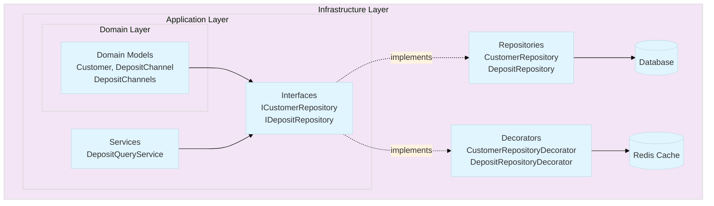

### Dependency Direction Diagram

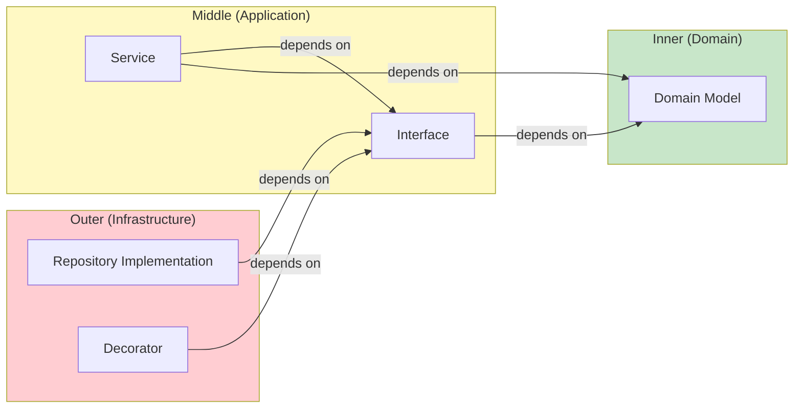

**Key Principle**: Dependency direction is always from outside to inside; inner layers don't know outer layers exist.

---

## Complete Request Flow Diagram

### GetDepositOptionsAsync API Flow

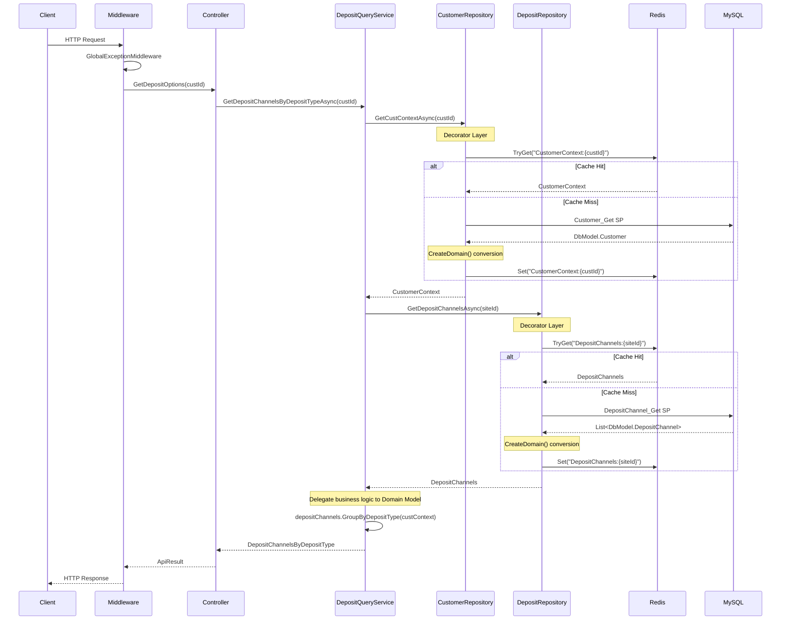

---

## Decorator Pattern Architecture Diagram

### Repository Decorator Structure

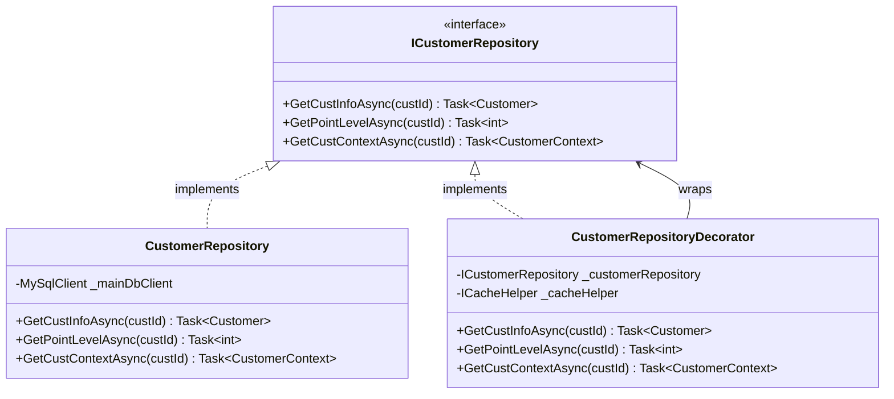

### DI Registration and Call Flow

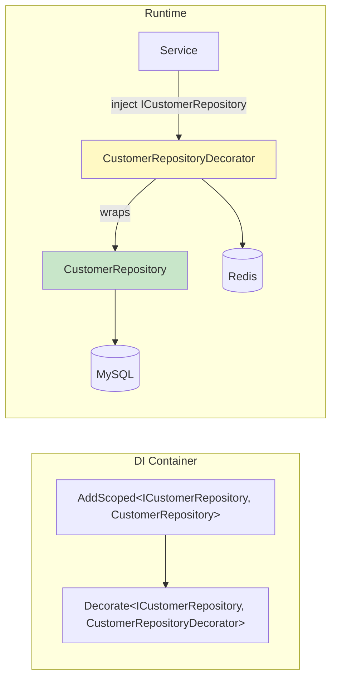

---

## Domain Model Structure Diagram

### Deposit-Related Domain Models

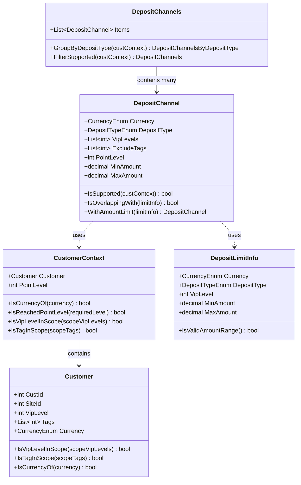

### DbModel and Domain Model Separation

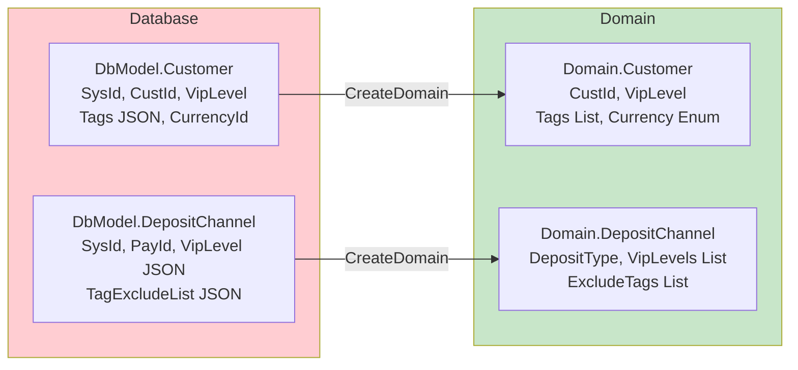

---

## Exception Handling Flow Diagram

### GlobalExceptionMiddleware Processing Flow

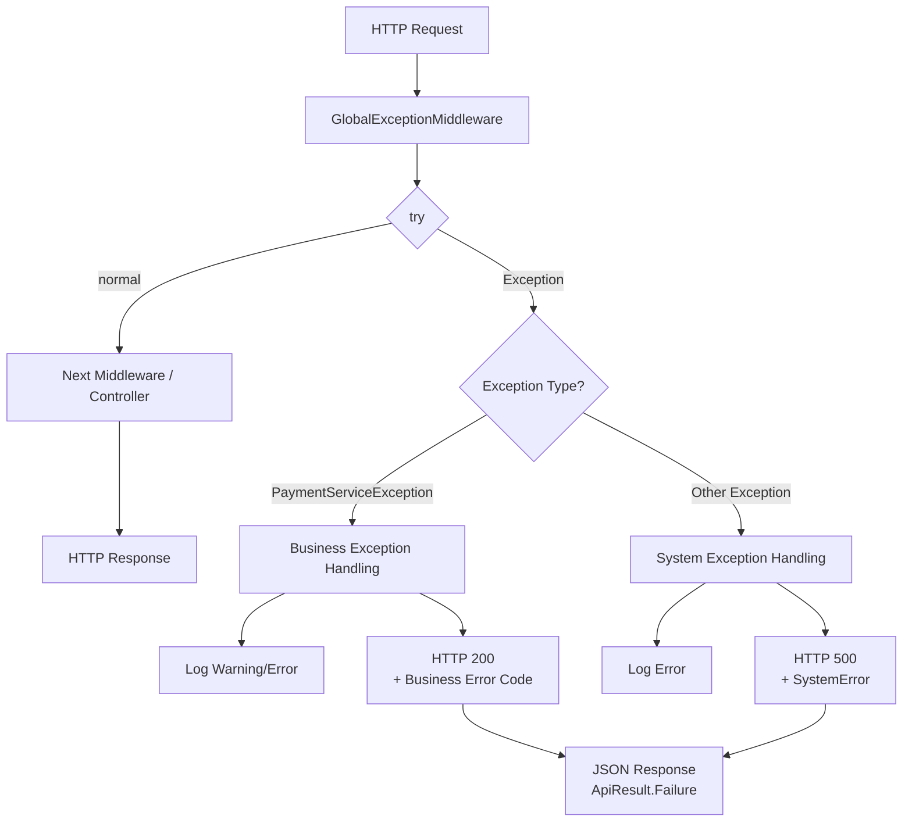

### PaymentError Structure

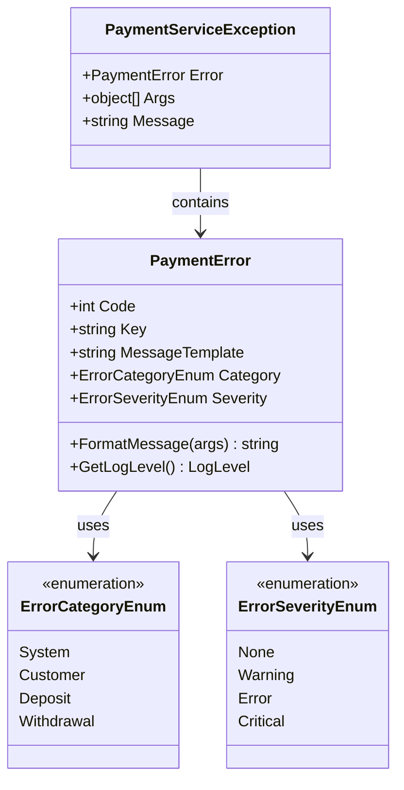

---

## Testing Architecture Diagram

### Test Project Structure

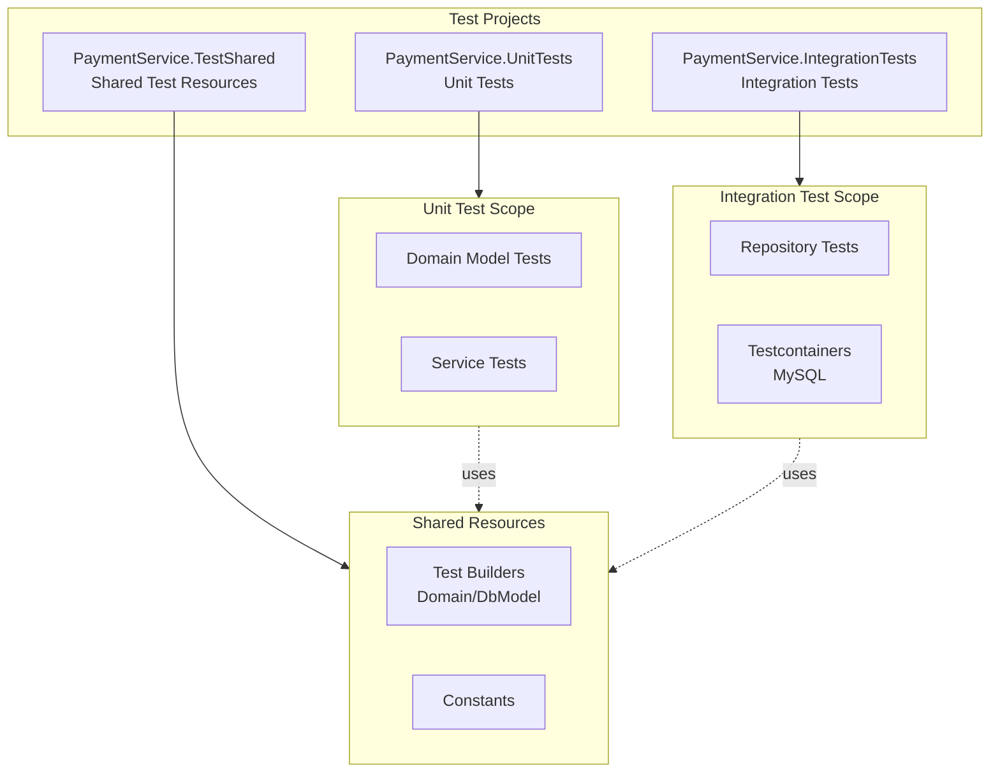

### Test Builder Pattern

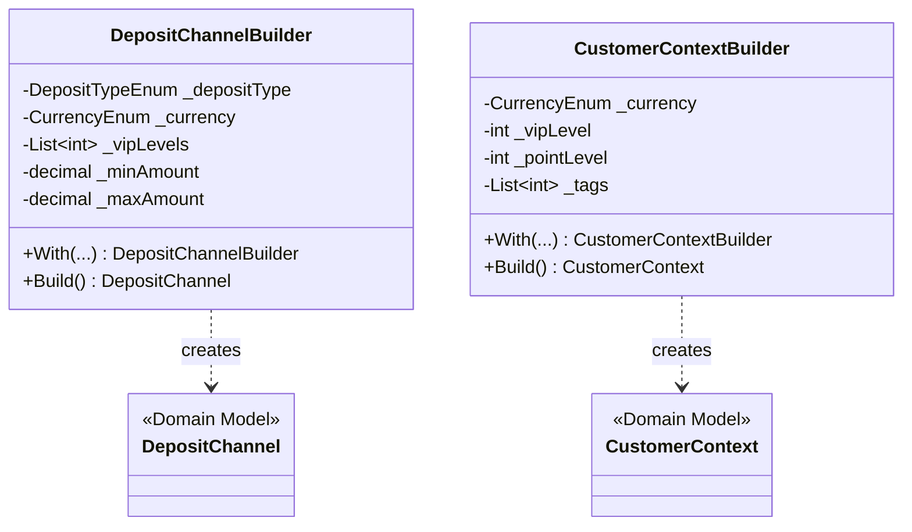

---

## Project Directory Structure Diagram

```
PaymentService/
├── Controllers/                    # Presentation Layer
│   └── CustomerController.cs
│
├── Models/
│   ├── Domain/                     # Domain Layer
│   │   ├── Customer.cs
│   │   ├── CustomerContext.cs
│   │   ├── DepositChannel.cs
│   │   ├── DepositChannels.cs
│   │   ├── DepositChannelsByDepositType.cs
│   │   ├── DepositLimitInfo.cs
│   │   └── DepositLimitInfos.cs
│   │
│   ├── DbModel/                    # Database Mapping
│   │   ├── Customer.cs
│   │   ├── DepositChannel.cs
│   │   └── DepositLimitInfo.cs
│   │
│   ├── Enum/                       # Enumerations
│   │   ├── CurrencyEnum.cs
│   │   ├── DepositTypeEnum.cs
│   │   ├── ErrorCategoryEnum.cs
│   │   └── ErrorSeverityEnum.cs
│   │
│   ├── Payload/                    # API Models
│   │   └── GetDepositOptionsRequest.cs
│   │
│   ├── ApiResult.cs
│   └── PaymentError.cs
│
├── Services/                       # Application Layer
│   ├── ICustomerRepository.cs      # Interface
│   ├── IDepositRepository.cs       # Interface
│   ├── IDepositQueryService.cs     # Interface
│   └── DepositQueryService.cs      # Implementation
│
├── Repositories/                   # Infrastructure Layer
│   ├── CustomerRepository.cs
│   ├── CustomerRepositoryDecorator.cs
│   ├── DepositRepository.cs
│   └── DepositRepositoryDecorator.cs
│
├── Middlewares/                    # Cross-Cutting Concerns
│   └── GlobalExceptionMiddleware.cs
│
├── Exceptions/                     # Custom Exceptions
│   ├── PaymentServiceException.cs
│   └── CustomerNotFoundException.cs
│
└── Extensions/                     # Extension Methods
    ├── StringExtensions.cs
    └── MiddlewareExtensions.cs
```

---

## Review Checklist

### Diagram Reading Confirmation

- [ ] I understand the concentric circle architecture dependency direction (outside to inside)
- [ ] I can identify where Decorator acts in the flow diagram
- [ ] I understand when Domain Model and DbModel conversion occurs
- [ ] I know the exception handling classification logic (business exception vs system exception)

### Architecture Understanding Confirmation

- [ ] I can explain why Repository interfaces are defined in the Services/ directory
- [ ] I can explain how Decorator pattern achieves cache separation
- [ ] I can describe how a complete API request flows through each layer

---

## Common Pitfalls for New Developers

### 1. Misunderstanding Dependency Direction

```
❌ Wrong Understanding:
Domain → Application → Infrastructure (inside to outside)

✅ Correct Understanding:
Infrastructure → Application → Domain (outside to inside)
Dependency direction: Outer layers depend on inner layers, inner layers don't know outer layers exist
```

### 2. Confusing Decorator with Inheritance

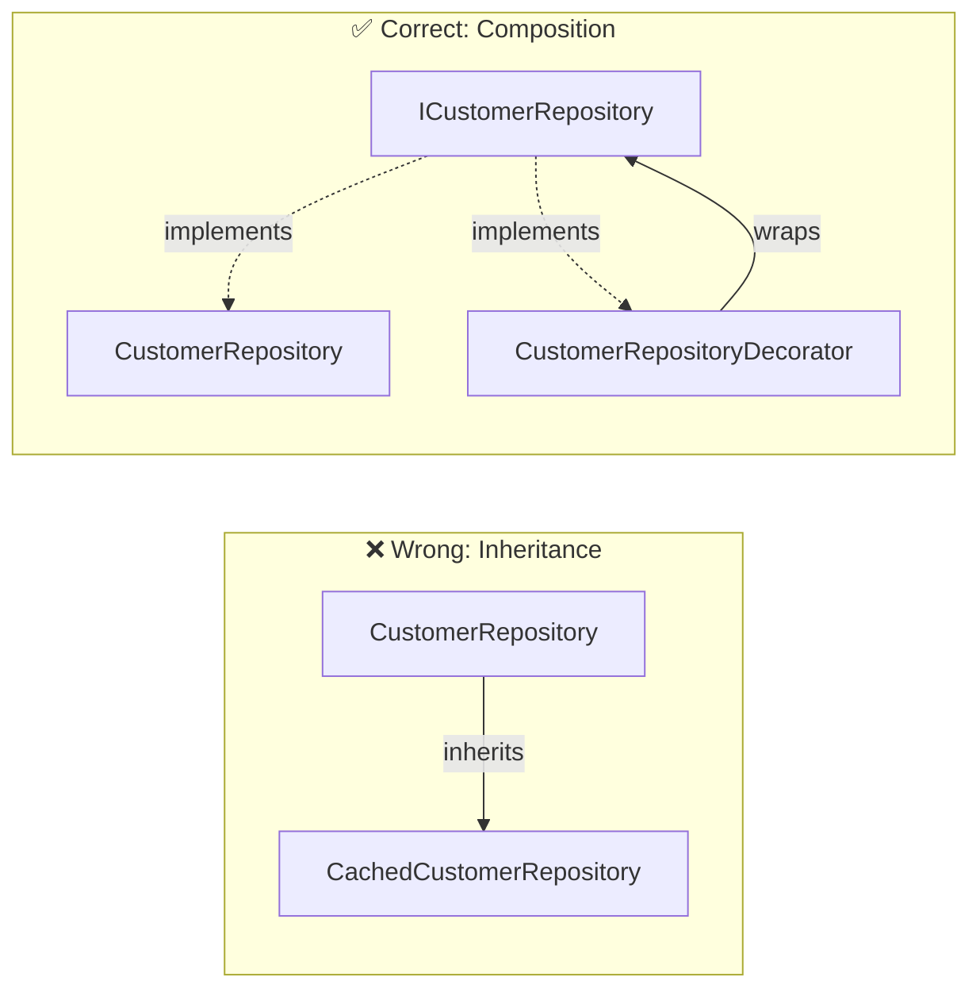

### 3. Handling Exceptions at the Wrong Layer

```
❌ Wrong: Catch in Repository and return null
✅ Correct: Let exception propagate up, let GlobalExceptionMiddleware handle uniformly
```

---

## TL / Reviewer Checkpoint

### Architecture Diagram Consistency

- [ ] Can new feature classes be correctly placed in existing architecture diagrams?
- [ ] Do dependency relationships violate layering principles?
- [ ] Are there any cross-layer direct dependencies?

### Flow Completeness

- [ ] Is the exception handling path complete?
- [ ] Is the caching strategy consistent?
- [ ] Are there any missing cross-cutting concerns?

---

> **Document Version**: v1.0
> **Last Updated**: 2024-11
