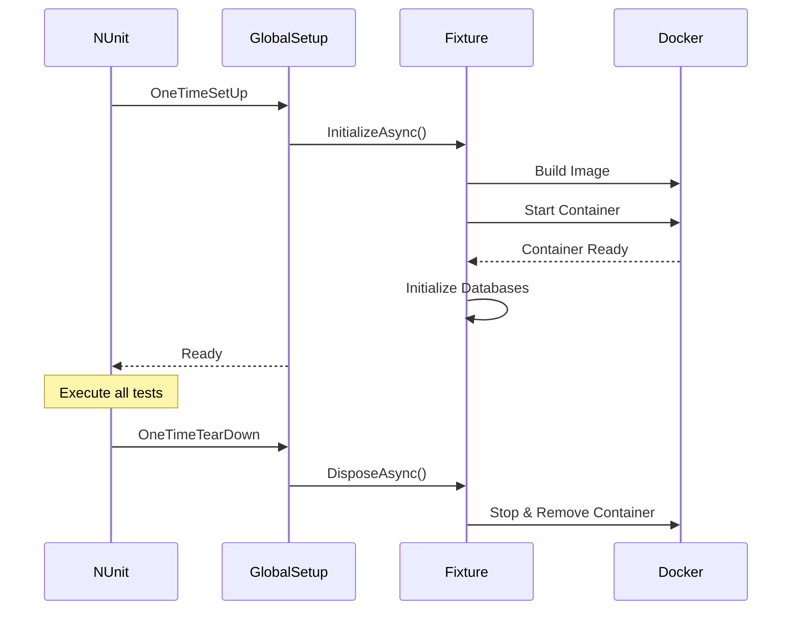

# MySQL Testcontainers Quick Reference

## Table of Contents

1. [Overview](#overview)
2. [Project Structure](#project-structure)
3. [Environment Requirements](#environment-requirements)
4. [MySqlContainerFixture Architecture](#mysqlcontainerfixture-architecture)
5. [GlobalSetup Configuration](#globalsetup-configuration)
6. [TestDataManager Design](#testdatamanager-design)
7. [PrimitiveModel Pattern](#primitivemodel-pattern)
8. [Writing Integration Tests](#writing-integration-tests)
9. [Docker Configuration](#docker-configuration)
10. [Common Troubleshooting](#common-troubleshooting)

---

## Overview

This project uses **Testcontainers** to run a real MySQL database in Docker for integration testing, ensuring the correctness of Repository layer interactions with the database.

### Core Features

| Feature | Description |
|---------|-------------|
| **Real Database** | Uses MySQL 8.0.22 container |
| **Automated Management** | Automatically starts at test begin, cleans up after |
| **Schema Sync** | Auto-downloads latest database structure from Git |
| **Test Isolation** | Clears data before each test, ensuring independence |

### NuGet Packages Used

```xml
<PackageReference Include="Testcontainers" Version="3.7.0" />
<PackageReference Include="Testcontainers.MySql" Version="3.7.0" />
<PackageReference Include="LibGit2Sharp" Version="0.30.0" />
<PackageReference Include="MySqlConnector" Version="2.3.5" />
```

---

## Project Structure

```
PaymentService.IntegrationTests/
├── Docker/
│   ├── Dockerfile              # Custom MySQL image
│   └── init.sh                 # Database initialization script
│
├── Fixtures/
│   ├── MySqlContainerFixture.cs       # Container management core
│   ├── MySqlContainerFixtureBuilder.cs # Fluent Builder
│   ├── TestDataManagerBase.cs         # Data management base class
│   ├── SiebogDataManager.cs           # Siebog database manager
│   └── DatabaseNames.cs               # Database name constants
│
├── PrimitiveModels/
│   ├── IPrimitiveModel.cs      # Primitive model interface
│   ├── PrimitiveCustomer.cs    # Customer primitive model
│   └── PrimitiveCustVip.cs     # VIP primitive model
│
├── GlobalSetup.cs              # NUnit global setup
└── CustomerRepositoryTests.cs  # Integration test example
```

---

## Environment Requirements

### Prerequisites

1. **Docker Desktop** - Must be installed and running
2. **Git** - Need access to database schema Git repository
3. **Git Credentials** - Configure one of the following:
   - Environment variables: `GIT_USERNAME`, `GIT_PASSWORD`
   - Git Credential Manager (GCM)

### Environment Variable Setup

```bash
# Windows PowerShell
$env:GIT_USERNAME = "your-username"
$env:GIT_PASSWORD = "your-password-or-token"

# Linux/Mac
export GIT_USERNAME="your-username"
export GIT_PASSWORD="your-password-or-token"
```

### Windows Special Note

```csharp
// Already configured in MySqlContainerFixture constructor
static MySqlContainerFixture()
{
    // Disable Ryuk (Resource Reaper) to avoid Windows initialization issues
    Environment.SetEnvironmentVariable("TESTCONTAINERS_RYUK_DISABLED", "true");
}
```

---

## MySqlContainerFixture Architecture

### Core Design

```csharp
public class MySqlContainerFixture : IAsyncDisposable
{
    private MySqlContainer? _container;
    private IFutureDockerImage? _image;
    private readonly Dictionary<string, string> _connectionStrings = new();
    private readonly Dictionary<string, IEnumerable<MySqlClient>> _mySqlClients = new();

    // Initialization flow
    public async Task InitializeAsync()
    {
        await DownloadDatabaseScriptsAsync();  // 1. Download Schema
        await BuildDockerImageAsync();          // 2. Build image
        await StartContainerAsync();            // 3. Start container
        await InitializeDatabasesAsync();       // 4. Initialize databases
        CreateMySqlClients();                   // 5. Create connections
    }
}
```

### Database Script Caching

```csharp
private Task DownloadDatabaseScriptsAsync()
{
    // Use 2-hour cache
    if (Directory.Exists(_localScriptsPath))
    {
        var lastWriteTime = Directory.GetLastWriteTime(_localScriptsPath);
        if (DateTime.Now - lastWriteTime < TimeSpan.FromHours(2))
        {
            Console.WriteLine("Using cached database scripts (downloaded within 2 hours)");
            return Task.CompletedTask;
        }
    }

    // Clone latest schema
    var cloneOptions = new CloneOptions
    {
        BranchName = "main",
        FetchOptions = { CredentialsProvider = (_, _, _) => gitCredentials }
    };
    Repository.Clone(_scriptRepoUrl, _localScriptsPath, cloneOptions);
}
```

### Getting Connection Strings

```csharp
// Get connection string for specific database
public string GetConnectionString(string databaseName)
{
    if (!_connectionStrings.TryGetValue(databaseName, out var connectionString))
        throw new InvalidOperationException($"Database '{databaseName}' was not initialized.");
    return connectionString;
}

// Get all MySqlClient instances
public IEnumerable<MySqlClient> GetMySqlClients()
    => _mySqlClients.SelectMany(pair => pair.Value);
```

### Builder Pattern

```csharp
public class MySqlContainerFixtureBuilder
{
    private readonly HashSet<string> _databases = new();

    public MySqlContainerFixtureBuilder WithAllDatabases()
    {
        foreach (var db in DatabaseNames.All)
            _databases.Add(db);
        return this;
    }

    public MySqlContainerFixture Build()
    {
        if (_databases.Count == 0)
            throw new InvalidOperationException("No databases specified.");
        return new MySqlContainerFixture(_databases.ToArray());
    }
}
```

---

## GlobalSetup Configuration

### NUnit SetUpFixture

```csharp
[SetUpFixture]
public class GlobalSetup
{
    // Globally shared Fixture instance
    public static MySqlContainerFixture MySqlFixture { get; private set; } = null!;

    [OneTimeSetUp]
    public async Task OneTimeSetUp()
    {
        // Use Builder to create and initialize
        MySqlFixture = new MySqlContainerFixtureBuilder()
            .WithAllDatabases()
            .Build();
        await MySqlFixture.InitializeAsync();
    }

    [OneTimeTearDown]
    public async Task OneTimeTearDown()
    {
        // Cleanup container
        await MySqlFixture.DisposeAsync();
    }
}
```

### Lifecycle



---

## TestDataManager Design

### Base Class

```csharp
public abstract class TestDataManagerBase
{
    private readonly string _connectionString;

    protected TestDataManagerBase(string connectionString)
    {
        _connectionString = connectionString;
    }

    // Subclass defines tables to truncate
    protected abstract string[] TruncateTables { get; }

    // Truncate test data
    public async Task TruncateTestDataAsync()
    {
        await using var connection = new MySqlConnection(_connectionString);
        await connection.OpenAsync();

        try
        {
            await ExecuteAsync("SET FOREIGN_KEY_CHECKS = 0;", connection);
            foreach (var table in TruncateTables)
                await ExecuteAsync($"TRUNCATE TABLE `{table}`;", connection);
        }
        finally
        {
            await ExecuteAsync("SET FOREIGN_KEY_CHECKS = 1;", connection);
        }
    }

    // Insert test data
    public async Task InitializeTableAsync<T>(params T[] entities)
        where T : IPrimitiveModel
    {
        // Auto-generate INSERT SQL based on PrimitiveModel
        var tableName = typeof(T).Name.Replace("Primitive", "");
        var properties = GetPrimitiveProperties<T>();
        var columns = string.Join(", ", properties.Select(p => $"`{p.Name}`"));
        var parameters = string.Join(", ", properties.Select(p => $"@{p.Name}"));
        var sql = $"INSERT INTO `{tableName}` ({columns}) VALUES ({parameters});";

        await ExecuteAsync(sql, connection, entities);
    }
}
```

### Concrete Implementation

```csharp
public class SiebogDataManager : TestDataManagerBase
{
    public SiebogDataManager(string connectionString)
        : base(connectionString)
    {
    }

    // Define tables to truncate
    protected override string[] TruncateTables { get; } =
    {
        "Customer",
        "CustVip"
    };
}
```

---

## PrimitiveModel Pattern

### Design Philosophy

PrimitiveModel is a lightweight data model specifically for integration test data insertion:
- Property names exactly match database columns
- Contains only necessary properties, no business logic
- Completely separate from Domain Model

### Interface Definition

```csharp
public interface IPrimitiveModel
{
    // Marker interface, no methods
}
```

### Implementation Examples

```csharp
public class PrimitiveCustomer : IPrimitiveModel
{
    public int CustId { get; set; }
    public int SiteId { get; set; }
    public string UserName { get; set; } = string.Empty;
    public string Userpwd { get; set; } = string.Empty;
    public int CurrencyId { get; set; }
    public string UserLang { get; set; } = "en";
    public sbyte ActStatus { get; set; }
    public int AgentId { get; set; }
    public string? AllAgentId { get; set; }     // JSON
    public int UserLevel { get; set; }
    public DateTime? LastLoginTime { get; set; }
    public DateTime RegTime { get; set; }
    public bool IsTest { get; set; }
    public sbyte Status { get; set; }
    public string? TagList { get; set; }        // JSON
    // ... other columns
}

public class PrimitiveCustVip : IPrimitiveModel
{
    public int CustId { get; set; }
    public string UserName { get; set; } = string.Empty;
    public int SiteId { get; set; }
    public int VipLevel { get; set; }
    public int DefaultLevel { get; set; }
}
```

---

## Writing Integration Tests

### Test Class Structure

```csharp
[TestFixture]
[Category("Integration")]  // Mark as integration test
public class CustomerRepositoryTests
{
    private ICustomerRepository _repository = null!;
    private SiebogDataManager _siebogDataManager;

    [SetUp]
    public async Task SetUp()
    {
        // 1. Get Fixture
        var fixture = GlobalSetup.MySqlFixture;

        // 2. Create DataManager and truncate data
        _siebogDataManager = new SiebogDataManager(
            fixture.GetConnectionString(DatabaseNames.Siebog));
        await _siebogDataManager.TruncateTestDataAsync();

        // 3. Create Repository under test
        _repository = new CustomerRepository(fixture.GetMySqlClients());
    }
}
```

### Test Example

```csharp
[Test]
public async Task GetCustInfoAsync_WhenCustomerExists_ShouldReturnCustomer()
{
    // Given: Prepare test data
    const int TestCustId = 99999;
    const int TestSiteId = 1;
    const string TestUserName = "TestUser001";
    const int TestVipLevel = 3;
    const int TestCurrencyId = (int)CurrencyEnum.MYR;
    var testTags = new List<int> { 100, 200, 300 };

    await InsertTestCustomerAsync(
        custId: TestCustId,
        userName: TestUserName,
        siteId: TestSiteId,
        vipLevel: TestVipLevel,
        currencyId: TestCurrencyId,
        tags: testTags);

    // When: Execute query
    var result = await _repository.GetCustInfoAsync(TestCustId);

    // Then: Verify result
    result.Should().NotBeNull("customer should exist in database");
    result.CustId.Should().Be(TestCustId, "customer ID should match");
    result.SiteId.Should().Be(TestSiteId, "site ID should match");
    result.VipLevel.Should().Be(TestVipLevel, "VIP level should match");
    result.Currency.Should().Be(CurrencyEnum.MYR, "currency should be MYR");
    result.Tags.Should().BeEquivalentTo(testTags, "tags should match");
}
```

### Data Insertion Helper

```csharp
private async Task InsertTestCustomerAsync(
    int custId,
    string userName,
    int siteId = 1,
    int vipLevel = 0,
    int currencyId = 1,
    List<int>? tags = null)
{
    // Insert Customer table
    var customer = new PrimitiveCustomer
    {
        CustId = custId,
        SiteId = siteId,
        UserName = userName,
        Userpwd = "test_password_hash",
        CurrencyId = currencyId,
        AgentId = 1,
        UserLevel = vipLevel,
        ActStatus = 1,
        TagList = tags != null && tags.Any()
            ? JsonSerializer.Serialize(tags)
            : null
    };
    await _siebogDataManager.InitializeTableAsync(customer);

    // Insert CustVip table
    var custVip = new PrimitiveCustVip
    {
        CustId = custId,
        UserName = userName,
        SiteId = siteId,
        VipLevel = vipLevel,
        DefaultLevel = vipLevel
    };
    await _siebogDataManager.InitializeTableAsync(custVip);
}
```

---

## Docker Configuration

### Dockerfile

```dockerfile
FROM mysql:8.0.22

WORKDIR /app

# Copy initialization script
COPY init.sh /app/init.sh
RUN chmod +x /app/init.sh && \
    sed -i 's/\r$//' /app/init.sh  # Handle Windows line endings

# Allow creating functions without DETERMINISTIC declaration
CMD ["--log-bin-trust-function-creators=1"]

EXPOSE 3306
```

### init.sh Initialization Script

```bash
#!/bin/bash
export MYSQL_PWD="$MYSQL_ROOT_PASSWORD"
export INIT_DATABASES="${INIT_DATABASES:-Siebog}"

echo "=== Database Setup Script ==="
echo "Databases to initialize: $INIT_DATABASES"

# Wait for MySQL to start
max_attempts=30
attempt=0
while [ $attempt -lt $max_attempts ]; do
    if mysql -u root -e "SELECT 1" > /dev/null 2>&1; then
        echo "MySQL is ready!"
        break
    fi
    attempt=$((attempt + 1))
    sleep 1
done

# Create user
mysql -u root -e "CREATE USER IF NOT EXISTS 'nova88'@'%' IDENTIFIED BY 'nova88pass';"
mysql -u root -e "GRANT ALL PRIVILEGES ON *.* TO 'nova88'@'%' WITH GRANT OPTION;"
mysql -u root -e "FLUSH PRIVILEGES;"

# Initialize each database
IFS=',' read -ra DB_ARRAY <<< "$INIT_DATABASES"
for db_name in "${DB_ARRAY[@]}"; do
    db_dir="/app/nova88prd/$db_name"

    mysql -u root -e "CREATE DATABASE IF NOT EXISTS $db_name;"
    mysql -u root -e "GRANT ALL PRIVILEGES ON $db_name.* TO '$MYSQL_USER'@'%';"

    # Phase 1: Create tables
    find "$db_dir" -name "*.sql" -type f | while read sql_file; do
        if head -1 "$sql_file" | grep -q "^CREATE TABLE"; then
            mysql -u root "$db_name" -e "source $sql_file"
        fi
    done

    # Phase 2: Create Stored Procedures
    find "$db_dir" -name "*.sql" -type f | while read sql_file; do
        if head -1 "$sql_file" | grep -q "^DELIMITER"; then
            mysql -u root "$db_name" -e "source $sql_file"
        fi
    done
done

echo "Setup completed!"
```

---

## Common Troubleshooting

### 1. Docker Desktop Not Running

```
Error: Docker is not running
```

**Solution**: Ensure Docker Desktop is started and running properly.

### 2. Git Credential Issues

```
Error: No Git credentials available
```

**Solution**:
```bash
# Method 1: Set environment variables
export GIT_USERNAME="your-username"
export GIT_PASSWORD="your-token"

# Method 2: Manually clone once to let GCM store credentials
git clone https://atgit.owgps.net/at-atlas/nova88prd.git
```

### 3. Container Startup Timeout

```
Error: MySQL did not become ready within 30 seconds
```

**Solution**:
- Check Docker resource configuration (CPU, memory)
- Check if other containers are consuming resources
- Try cleaning Docker cache: `docker system prune`

### 4. Windows Line Ending Issues

```
Error: /bin/bash^M: bad interpreter
```

**Solution**: Already handled in Dockerfile:
```dockerfile
RUN sed -i 's/\r$//' /app/init.sh
```

### 5. Test Failure: Data Not Cleared

**Solution**: Ensure `TruncateTestDataAsync` is called in `SetUp`:
```csharp
[SetUp]
public async Task SetUp()
{
    await _siebogDataManager.TruncateTestDataAsync();  // Ensure truncation every time
}
```

---

## Review Checklist

### Integration Test Structure Check
- [ ] Test class marked with `[Category("Integration")]`
- [ ] SetUp correctly obtains `GlobalSetup.MySqlFixture`
- [ ] SetUp calls `TruncateTestDataAsync` to clear data
- [ ] Uses Given-When-Then structure

### Fixture Configuration Check
- [ ] GlobalSetup uses `[SetUpFixture]` attribute
- [ ] Correctly uses Builder to configure databases
- [ ] `OneTimeTearDown` releases resources

### PrimitiveModel Check
- [ ] Implements `IPrimitiveModel` interface
- [ ] Property names match database columns
- [ ] Class name starts with `Primitive`

### DataManager Check
- [ ] Inherits from `TestDataManagerBase`
- [ ] Implements `TruncateTables` property
- [ ] Includes all related tables

---

## Common Pitfalls for New Developers

### 1. Forgetting to Clear Test Data

```csharp
// ❌ Wrong: SetUp doesn't clear data
[SetUp]
public void SetUp()
{
    var fixture = GlobalSetup.MySqlFixture;
    _repository = new CustomerRepository(fixture.GetMySqlClients());
    // Missing TruncateTestDataAsync
}

// ✅ Correct: clear before each test
[SetUp]
public async Task SetUp()
{
    var fixture = GlobalSetup.MySqlFixture;
    _siebogDataManager = new SiebogDataManager(fixture.GetConnectionString(DatabaseNames.Siebog));
    await _siebogDataManager.TruncateTestDataAsync();  // Clear data
    _repository = new CustomerRepository(fixture.GetMySqlClients());
}
```

### 2. PrimitiveModel Property Names Don't Match Database

```csharp
// ❌ Wrong: using Domain Model naming
public class PrimitiveCustomer : IPrimitiveModel
{
    public int CustomerId { get; set; }  // Should be CustId
    public string Username { get; set; }  // Should be UserName
}

// ✅ Correct: exactly match database columns
public class PrimitiveCustomer : IPrimitiveModel
{
    public int CustId { get; set; }
    public string UserName { get; set; }
}
```

### 3. Not Properly Handling JSON Columns

```csharp
// ❌ Wrong: directly passing List
customer.TagList = testTags;  // Wrong, database column is JSON string

// ✅ Correct: serialize to JSON
customer.TagList = tags != null && tags.Any()
    ? JsonSerializer.Serialize(tags)
    : null;
```

### 4. Mixing Unit Test and Integration Test

```csharp
// ❌ Wrong: using Mock in integration test
[Test]
[Category("Integration")]
public async Task GetCustInfoAsync_Test()
{
    var mockRepo = Substitute.For<ICustomerRepository>();  // Integration test shouldn't use Mock
}

// ✅ Correct: integration test uses real implementation
[Test]
[Category("Integration")]
public async Task GetCustInfoAsync_Test()
{
    _repository = new CustomerRepository(fixture.GetMySqlClients());  // Real implementation
}
```

### 5. Forgetting async/await

```csharp
// ❌ Wrong: SetUp is not async
[SetUp]
public void SetUp()
{
    _siebogDataManager.TruncateTestDataAsync();  // No await, won't wait for completion
}

// ✅ Correct: use async Task
[SetUp]
public async Task SetUp()
{
    await _siebogDataManager.TruncateTestDataAsync();
}
```

---

## TL/Reviewer Checkpoint

### 1. Resource Management

- [ ] Is there proper `IAsyncDisposable` implementation?
- [ ] Does `OneTimeTearDown` release containers?
- [ ] Are connection strings properly managed?

### 2. Test Isolation

- [ ] Is each test independent? Not depending on other tests' data?
- [ ] Does SetUp clear all related tables?
- [ ] Is foreign key truncation order considered?

### 3. Performance Considerations

- [ ] Is `[SetUpFixture]` used to share containers? (Avoid starting container for each test)
- [ ] Are database scripts cached?
- [ ] Are only necessary databases initialized?

### 4. Maintainability

- [ ] Is PrimitiveModel in sync with database structure?
- [ ] Does DataManager include all necessary tables?
- [ ] Is Docker configuration version controlled?

### 5. Security

- [ ] Are Git credentials using environment variables, not hardcoded?
- [ ] Does test data not contain real sensitive information?
- [ ] Are database passwords test-specific values?
