# 架構圖表

> 本文提供 PaymentService 專案的各類架構視覺化圖表，使用 Mermaid 語法以支援 Confluence 和 GitHub 渲染。

---

## 同心圓架構圖

### Clean Architecture 分層示意

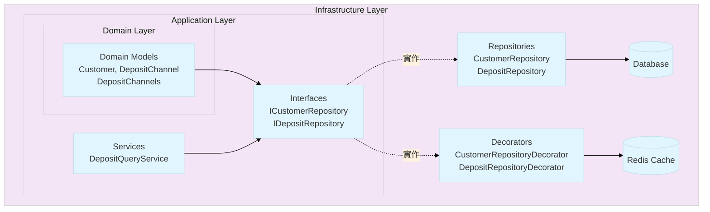

### 依賴方向圖

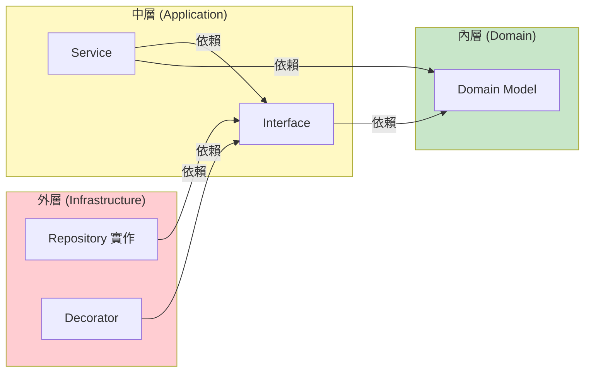

**關鍵原則**：依賴方向永遠由外向內，內層不知道外層的存在。

---

## 完整請求流程圖

### GetDepositOptionsAsync API 流程

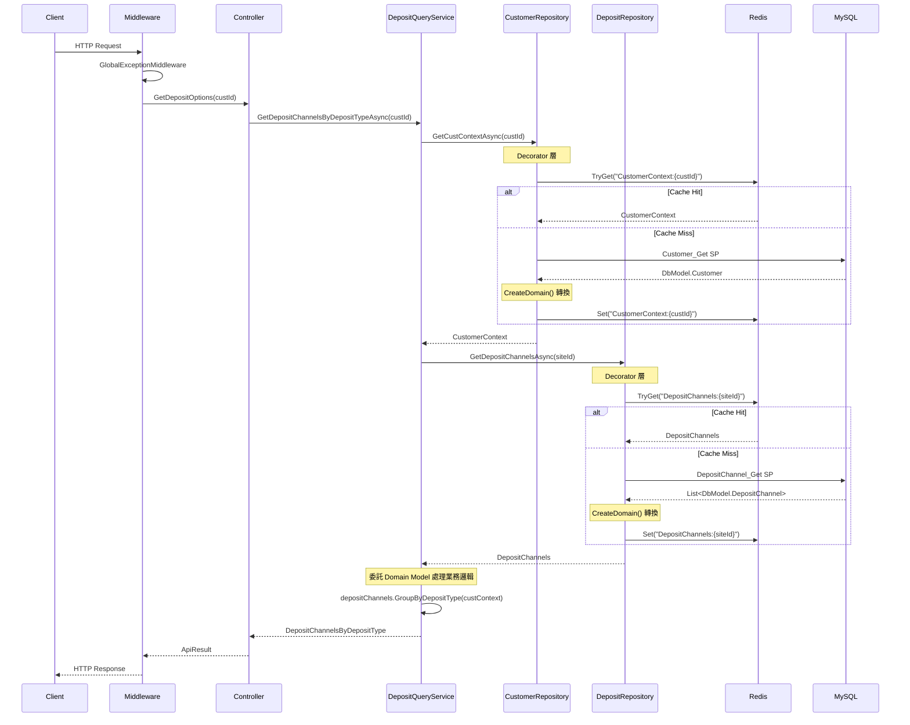

---

## Decorator 模式架構圖

### Repository Decorator 結構

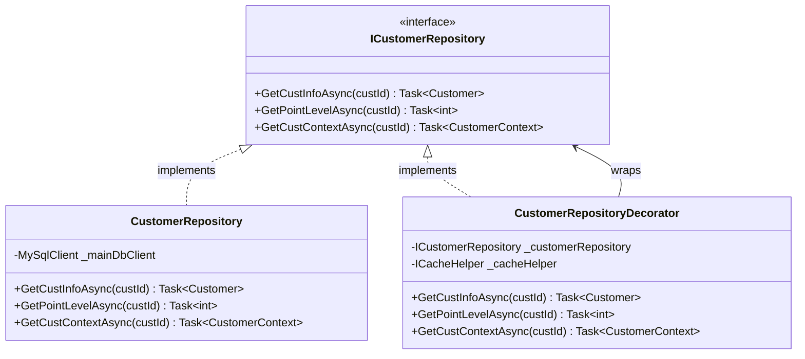

### DI 註冊與呼叫流程

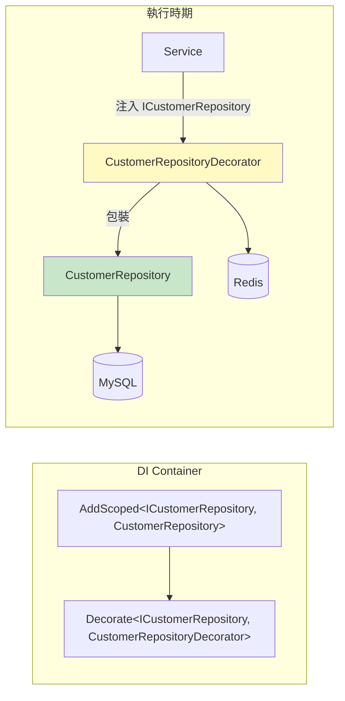

---

## Domain Model 結構圖

### 存款相關 Domain Models

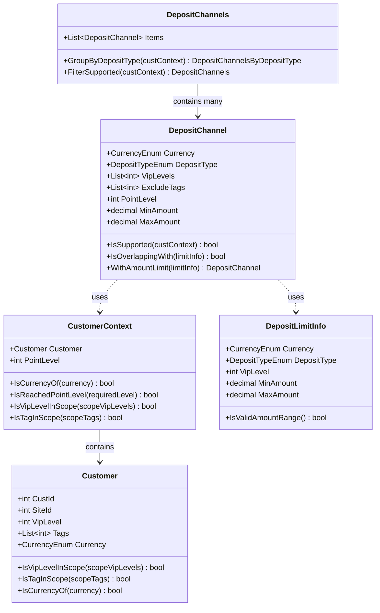

### DbModel 與 Domain Model 分離

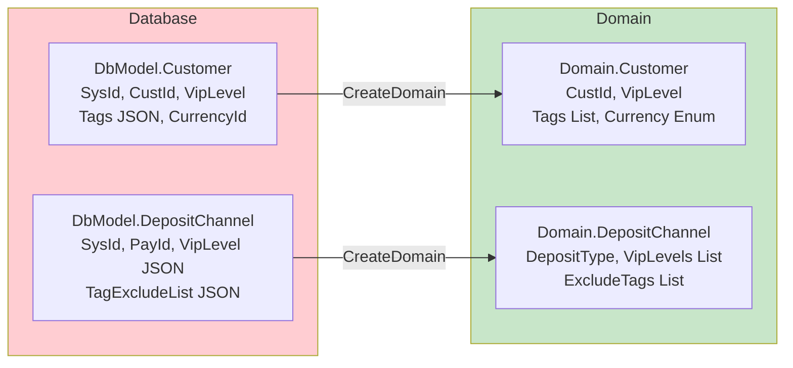

---

## 異常處理流程圖

### GlobalExceptionMiddleware 處理流程

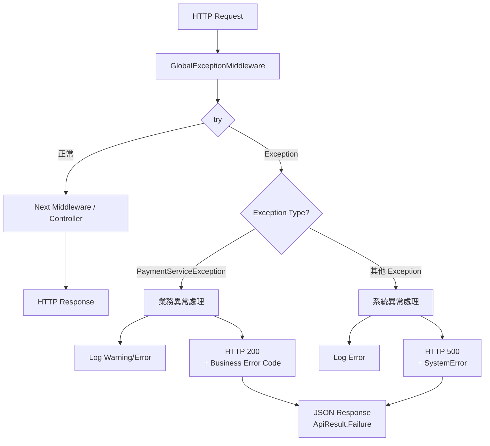

### PaymentError 結構

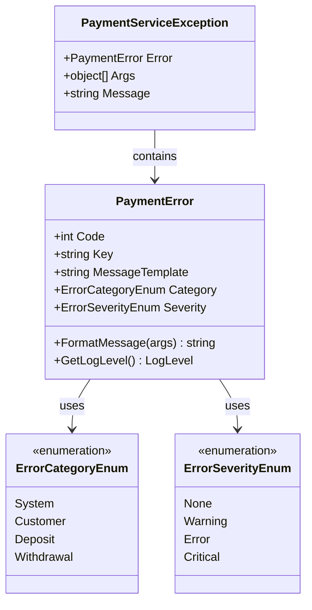

---

## 測試架構圖

### 測試專案結構

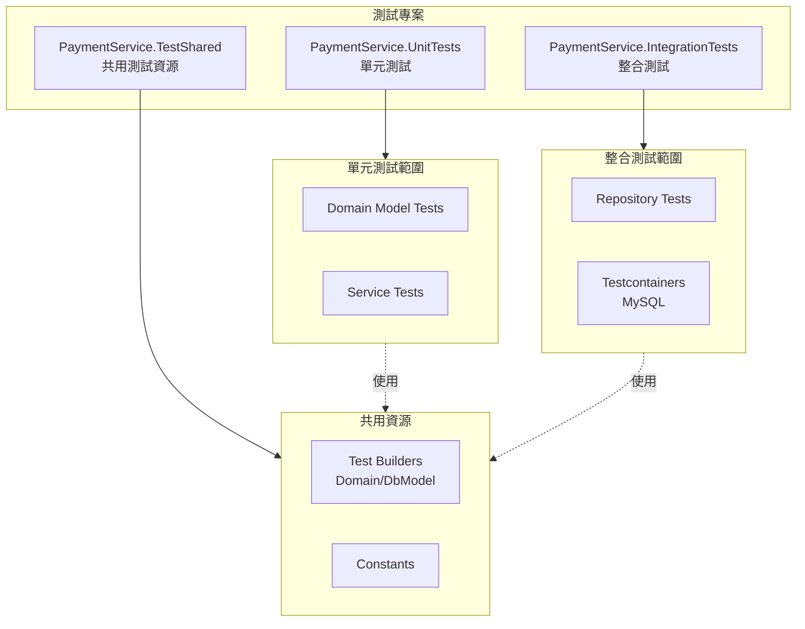

### Test Builder Pattern

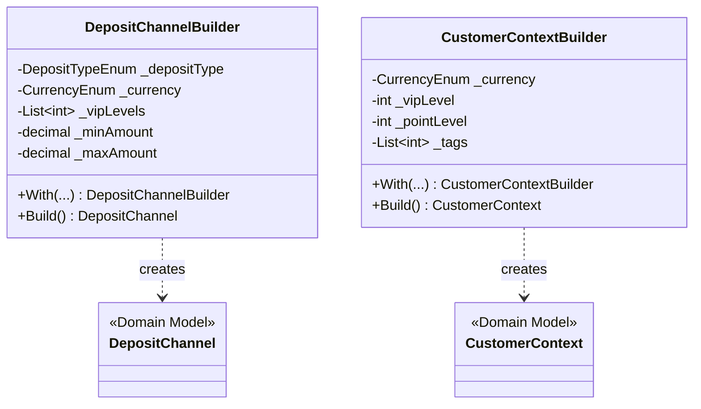

---

## 專案目錄結構圖

```
PaymentService/
├── Controllers/                    # Presentation Layer
│   └── CustomerController.cs
│
├── Models/
│   ├── Domain/                     # Domain Layer
│   │   ├── Customer.cs
│   │   ├── CustomerContext.cs
│   │   ├── DepositChannel.cs
│   │   ├── DepositChannels.cs
│   │   ├── DepositChannelsByDepositType.cs
│   │   ├── DepositLimitInfo.cs
│   │   └── DepositLimitInfos.cs
│   │
│   ├── DbModel/                    # Database Mapping
│   │   ├── Customer.cs
│   │   ├── DepositChannel.cs
│   │   └── DepositLimitInfo.cs
│   │
│   ├── Enum/                       # Enumerations
│   │   ├── CurrencyEnum.cs
│   │   ├── DepositTypeEnum.cs
│   │   ├── ErrorCategoryEnum.cs
│   │   └── ErrorSeverityEnum.cs
│   │
│   ├── Payload/                    # API Models
│   │   └── GetDepositOptionsRequest.cs
│   │
│   ├── ApiResult.cs
│   └── PaymentError.cs
│
├── Services/                       # Application Layer
│   ├── ICustomerRepository.cs      # Interface
│   ├── IDepositRepository.cs       # Interface
│   ├── IDepositQueryService.cs     # Interface
│   └── DepositQueryService.cs      # Implementation
│
├── Repositories/                   # Infrastructure Layer
│   ├── CustomerRepository.cs
│   ├── CustomerRepositoryDecorator.cs
│   ├── DepositRepository.cs
│   └── DepositRepositoryDecorator.cs
│
├── Middlewares/                    # Cross-Cutting Concerns
│   └── GlobalExceptionMiddleware.cs
│
├── Exceptions/                     # Custom Exceptions
│   ├── PaymentServiceException.cs
│   └── CustomerNotFoundException.cs
│
└── Extensions/                     # Extension Methods
    ├── StringExtensions.cs
    └── MiddlewareExtensions.cs
```

---

## ✅ Review Checklist

### 圖表閱讀確認

- [ ] 我理解同心圓架構的依賴方向（由外向內）
- [ ] 我能從流程圖中識別 Decorator 的作用位置
- [ ] 我了解 Domain Model 與 DbModel 的轉換時機
- [ ] 我知道異常處理的分類邏輯（業務異常 vs 系統異常）

### 架構理解確認

- [ ] 我能說明為何 Repository 介面定義在 Services/ 目錄
- [ ] 我能解釋 Decorator 模式如何實現快取分離
- [ ] 我能描述一個完整的 API 請求如何流經各層

---

## ✅ 新人常見踩雷點

### 1. 誤解依賴方向

```
❌ 錯誤理解：
Domain → Application → Infrastructure（由內向外）

✅ 正確理解：
Infrastructure → Application → Domain（由外向內）
依賴方向：外層依賴內層，內層不知道外層存在
```

### 2. 混淆 Decorator 與繼承

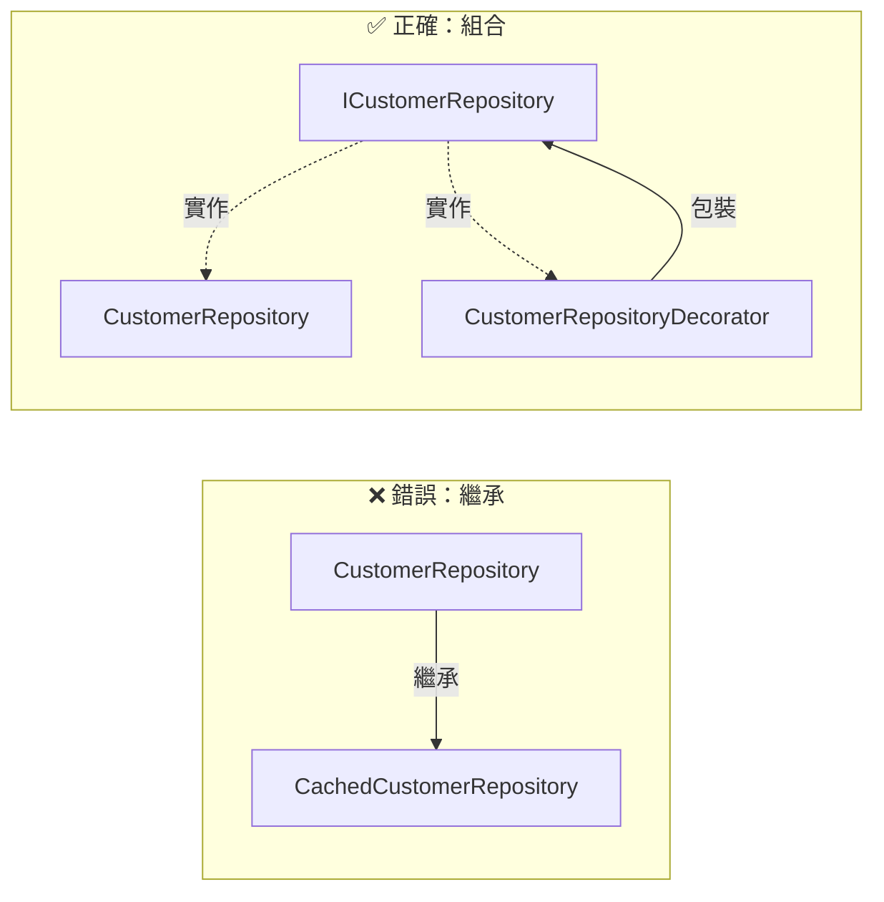

### 3. 在錯誤的層級處理異常

```
❌ 錯誤：在 Repository 中 catch 並回傳 null
✅ 正確：讓異常向上傳播，由 GlobalExceptionMiddleware 統一處理
```

---

## ✅ TL / Reviewer 檢查重點

### 架構圖一致性

- [ ] 新功能的類別是否能正確放入現有架構圖？
- [ ] 依賴關係是否違反分層原則？
- [ ] 是否有跨層直接依賴的情況？

### 流程完整性

- [ ] 異常處理路徑是否完整？
- [ ] 快取策略是否一致？
- [ ] 是否有遺漏的橫切關注點？

---

> **文件版本**: v1.0
> **最後更新**: 2024-11
