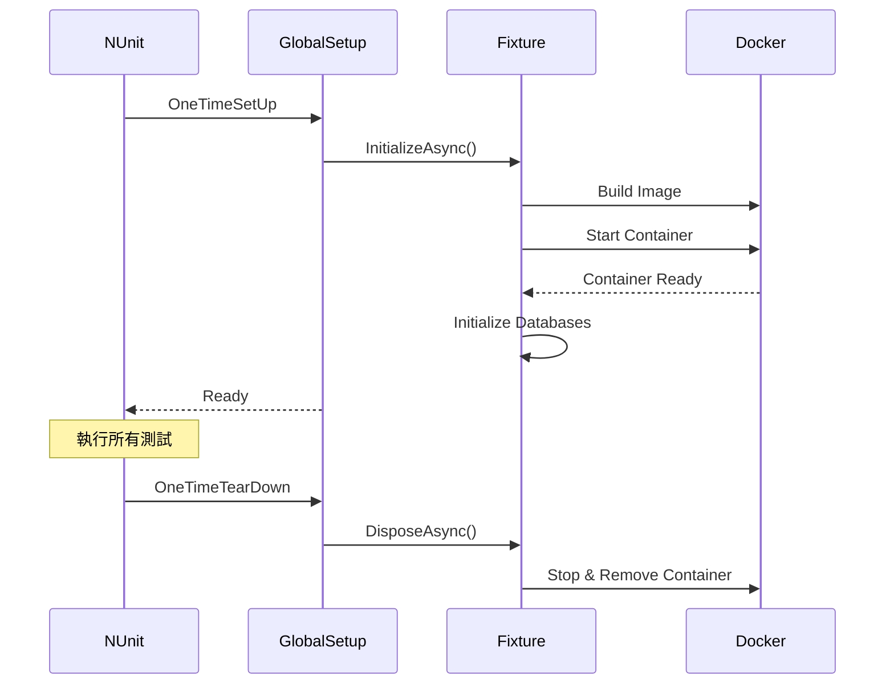

# 15-MySQL Testcontainers 快速參考

## 目錄

1. [概述](#概述)
2. [專案結構](#專案結構)
3. [環境需求](#環境需求)
4. [MySqlContainerFixture 架構](#mysqlcontainerfixture-架構)
5. [GlobalSetup 配置](#globalsetup-配置)
6. [TestDataManager 設計](#testdatamanager-設計)
7. [PrimitiveModel 模式](#primitivemodel-模式)
8. [撰寫整合測試](#撰寫整合測試)
9. [Docker 配置](#docker-配置)
10. [常見問題排解](#常見問題排解)

---

## 概述

本專案使用 **Testcontainers** 在 Docker 中執行真實的 MySQL 資料庫進行整合測試，確保 Repository 層與資料庫的互動正確性。

### 核心特點

| 特點 | 說明 |
|------|------|
| **真實資料庫** | 使用 MySQL 8.0.22 容器 |
| **自動化管理** | 測試開始時自動啟動，結束後自動清理 |
| **Schema 同步** | 從 Git 自動下載最新資料庫結構 |
| **測試隔離** | 每個測試前清空資料，確保獨立性 |

### 使用的 NuGet 套件

```xml
<PackageReference Include="Testcontainers" Version="3.7.0" />
<PackageReference Include="Testcontainers.MySql" Version="3.7.0" />
<PackageReference Include="LibGit2Sharp" Version="0.30.0" />
<PackageReference Include="MySqlConnector" Version="2.3.5" />
```

---

## 專案結構

```
PaymentService.IntegrationTests/
├── Docker/
│   ├── Dockerfile              # 自訂 MySQL 映像
│   └── init.sh                 # 資料庫初始化腳本
│
├── Fixtures/
│   ├── MySqlContainerFixture.cs       # 容器管理核心
│   ├── MySqlContainerFixtureBuilder.cs # Fluent Builder
│   ├── TestDataManagerBase.cs         # 資料管理基底類別
│   ├── SiebogDataManager.cs           # Siebog 資料庫管理器
│   └── DatabaseNames.cs               # 資料庫名稱常數
│
├── PrimitiveModels/
│   ├── IPrimitiveModel.cs      # 原始模型介面
│   ├── PrimitiveCustomer.cs    # 客戶原始模型
│   └── PrimitiveCustVip.cs     # VIP 原始模型
│
├── GlobalSetup.cs              # NUnit 全域設定
└── CustomerRepositoryTests.cs  # 整合測試範例
```

---

## 環境需求

### 必要條件

1. **Docker Desktop** - 必須安裝並啟動
2. **Git** - 需要存取資料庫 schema 的 Git 儲存庫
3. **Git 憑證** - 設定方式二選一：
   - 環境變數：`GIT_USERNAME`、`GIT_PASSWORD`
   - Git Credential Manager (GCM)

### 環境變數設定

```bash
# Windows PowerShell
$env:GIT_USERNAME = "your-username"
$env:GIT_PASSWORD = "your-password-or-token"

# Linux/Mac
export GIT_USERNAME="your-username"
export GIT_PASSWORD="your-password-or-token"
```

### Windows 特別注意

```csharp
// 在 MySqlContainerFixture 建構子中已設定
static MySqlContainerFixture()
{
    // 停用 Ryuk (Resource Reaper) 避免 Windows 上的初始化問題
    Environment.SetEnvironmentVariable("TESTCONTAINERS_RYUK_DISABLED", "true");
}
```

---

## MySqlContainerFixture 架構

### 核心設計

```csharp
public class MySqlContainerFixture : IAsyncDisposable
{
    private MySqlContainer? _container;
    private IFutureDockerImage? _image;
    private readonly Dictionary<string, string> _connectionStrings = new();
    private readonly Dictionary<string, IEnumerable<MySqlClient>> _mySqlClients = new();

    // 初始化流程
    public async Task InitializeAsync()
    {
        await DownloadDatabaseScriptsAsync();  // 1. 下載 Schema
        await BuildDockerImageAsync();          // 2. 建構映像
        await StartContainerAsync();            // 3. 啟動容器
        await InitializeDatabasesAsync();       // 4. 初始化資料庫
        CreateMySqlClients();                   // 5. 建立連線
    }
}
```

### 資料庫腳本快取

```csharp
private Task DownloadDatabaseScriptsAsync()
{
    // 使用 2 小時快取
    if (Directory.Exists(_localScriptsPath))
    {
        var lastWriteTime = Directory.GetLastWriteTime(_localScriptsPath);
        if (DateTime.Now - lastWriteTime < TimeSpan.FromHours(2))
        {
            Console.WriteLine("Using cached database scripts (downloaded within 2 hours)");
            return Task.CompletedTask;
        }
    }

    // Clone 最新 schema
    var cloneOptions = new CloneOptions
    {
        BranchName = "main",
        FetchOptions = { CredentialsProvider = (_, _, _) => gitCredentials }
    };
    Repository.Clone(_scriptRepoUrl, _localScriptsPath, cloneOptions);
}
```

### 取得連線字串

```csharp
// 取得特定資料庫的連線字串
public string GetConnectionString(string databaseName)
{
    if (!_connectionStrings.TryGetValue(databaseName, out var connectionString))
        throw new InvalidOperationException($"Database '{databaseName}' was not initialized.");
    return connectionString;
}

// 取得所有 MySqlClient 實例
public IEnumerable<MySqlClient> GetMySqlClients()
    => _mySqlClients.SelectMany(pair => pair.Value);
```

### Builder 模式

```csharp
public class MySqlContainerFixtureBuilder
{
    private readonly HashSet<string> _databases = new();

    public MySqlContainerFixtureBuilder WithAllDatabases()
    {
        foreach (var db in DatabaseNames.All)
            _databases.Add(db);
        return this;
    }

    public MySqlContainerFixture Build()
    {
        if (_databases.Count == 0)
            throw new InvalidOperationException("No databases specified.");
        return new MySqlContainerFixture(_databases.ToArray());
    }
}
```

---

## GlobalSetup 配置

### NUnit SetUpFixture

```csharp
[SetUpFixture]
public class GlobalSetup
{
    // 全域共享的 Fixture 實例
    public static MySqlContainerFixture MySqlFixture { get; private set; } = null!;

    [OneTimeSetUp]
    public async Task OneTimeSetUp()
    {
        // 使用 Builder 建立並初始化
        MySqlFixture = new MySqlContainerFixtureBuilder()
            .WithAllDatabases()
            .Build();
        await MySqlFixture.InitializeAsync();
    }

    [OneTimeTearDown]
    public async Task OneTimeTearDown()
    {
        // 清理容器
        await MySqlFixture.DisposeAsync();
    }
}
```

### 生命週期



---

## TestDataManager 設計

### 基底類別

```csharp
public abstract class TestDataManagerBase
{
    private readonly string _connectionString;

    protected TestDataManagerBase(string connectionString)
    {
        _connectionString = connectionString;
    }

    // 子類別定義要清空的資料表
    protected abstract string[] TruncateTables { get; }

    // 清空測試資料
    public async Task TruncateTestDataAsync()
    {
        await using var connection = new MySqlConnection(_connectionString);
        await connection.OpenAsync();

        try
        {
            await ExecuteAsync("SET FOREIGN_KEY_CHECKS = 0;", connection);
            foreach (var table in TruncateTables)
                await ExecuteAsync($"TRUNCATE TABLE `{table}`;", connection);
        }
        finally
        {
            await ExecuteAsync("SET FOREIGN_KEY_CHECKS = 1;", connection);
        }
    }

    // 插入測試資料
    public async Task InitializeTableAsync<T>(params T[] entities)
        where T : IPrimitiveModel
    {
        // 自動根據 PrimitiveModel 產生 INSERT SQL
        var tableName = typeof(T).Name.Replace("Primitive", "");
        var properties = GetPrimitiveProperties<T>();
        var columns = string.Join(", ", properties.Select(p => $"`{p.Name}`"));
        var parameters = string.Join(", ", properties.Select(p => $"@{p.Name}"));
        var sql = $"INSERT INTO `{tableName}` ({columns}) VALUES ({parameters});";

        await ExecuteAsync(sql, connection, entities);
    }
}
```

### 具體實作

```csharp
public class SiebogDataManager : TestDataManagerBase
{
    public SiebogDataManager(string connectionString)
        : base(connectionString)
    {
    }

    // 定義需要清空的資料表
    protected override string[] TruncateTables { get; } =
    {
        "Customer",
        "CustVip"
    };
}
```

---

## PrimitiveModel 模式

### 設計理念

PrimitiveModel 是一個輕量級的資料模型，專門用於整合測試的資料插入：
- 屬性名稱與資料庫欄位完全對應
- 只包含必要的屬性，不含業務邏輯
- 與 Domain Model 完全分離

### 介面定義

```csharp
public interface IPrimitiveModel
{
    // 標記介面，無方法
}
```

### 實作範例

```csharp
public class PrimitiveCustomer : IPrimitiveModel
{
    public int CustId { get; set; }
    public int SiteId { get; set; }
    public string UserName { get; set; } = string.Empty;
    public string Userpwd { get; set; } = string.Empty;
    public int CurrencyId { get; set; }
    public string UserLang { get; set; } = "en";
    public sbyte ActStatus { get; set; }
    public int AgentId { get; set; }
    public string? AllAgentId { get; set; }     // JSON
    public int UserLevel { get; set; }
    public DateTime? LastLoginTime { get; set; }
    public DateTime RegTime { get; set; }
    public bool IsTest { get; set; }
    public sbyte Status { get; set; }
    public string? TagList { get; set; }        // JSON
    // ... 其他欄位
}

public class PrimitiveCustVip : IPrimitiveModel
{
    public int CustId { get; set; }
    public string UserName { get; set; } = string.Empty;
    public int SiteId { get; set; }
    public int VipLevel { get; set; }
    public int DefaultLevel { get; set; }
}
```

---

## 撰寫整合測試

### 測試類別結構

```csharp
[TestFixture]
[Category("Integration")]  // 標記為整合測試
public class CustomerRepositoryTests
{
    private ICustomerRepository _repository = null!;
    private SiebogDataManager _siebogDataManager;

    [SetUp]
    public async Task SetUp()
    {
        // 1. 取得 Fixture
        var fixture = GlobalSetup.MySqlFixture;

        // 2. 建立 DataManager 並清空資料
        _siebogDataManager = new SiebogDataManager(
            fixture.GetConnectionString(DatabaseNames.Siebog));
        await _siebogDataManager.TruncateTestDataAsync();

        // 3. 建立待測 Repository
        _repository = new CustomerRepository(fixture.GetMySqlClients());
    }
}
```

### 測試範例

```csharp
[Test]
public async Task GetCustInfoAsync_WhenCustomerExists_ShouldReturnCustomer()
{
    // Given: 準備測試資料
    const int TestCustId = 99999;
    const int TestSiteId = 1;
    const string TestUserName = "TestUser001";
    const int TestVipLevel = 3;
    const int TestCurrencyId = (int)CurrencyEnum.MYR;
    var testTags = new List<int> { 100, 200, 300 };

    await InsertTestCustomerAsync(
        custId: TestCustId,
        userName: TestUserName,
        siteId: TestSiteId,
        vipLevel: TestVipLevel,
        currencyId: TestCurrencyId,
        tags: testTags);

    // When: 執行查詢
    var result = await _repository.GetCustInfoAsync(TestCustId);

    // Then: 驗證結果
    result.Should().NotBeNull("customer should exist in database");
    result.CustId.Should().Be(TestCustId, "customer ID should match");
    result.SiteId.Should().Be(TestSiteId, "site ID should match");
    result.VipLevel.Should().Be(TestVipLevel, "VIP level should match");
    result.Currency.Should().Be(CurrencyEnum.MYR, "currency should be MYR");
    result.Tags.Should().BeEquivalentTo(testTags, "tags should match");
}
```

### 資料插入 Helper

```csharp
private async Task InsertTestCustomerAsync(
    int custId,
    string userName,
    int siteId = 1,
    int vipLevel = 0,
    int currencyId = 1,
    List<int>? tags = null)
{
    // 插入 Customer 表
    var customer = new PrimitiveCustomer
    {
        CustId = custId,
        SiteId = siteId,
        UserName = userName,
        Userpwd = "test_password_hash",
        CurrencyId = currencyId,
        AgentId = 1,
        UserLevel = vipLevel,
        ActStatus = 1,
        TagList = tags != null && tags.Any()
            ? JsonSerializer.Serialize(tags)
            : null
    };
    await _siebogDataManager.InitializeTableAsync(customer);

    // 插入 CustVip 表
    var custVip = new PrimitiveCustVip
    {
        CustId = custId,
        UserName = userName,
        SiteId = siteId,
        VipLevel = vipLevel,
        DefaultLevel = vipLevel
    };
    await _siebogDataManager.InitializeTableAsync(custVip);
}
```

---

## Docker 配置

### Dockerfile

```dockerfile
FROM mysql:8.0.22

WORKDIR /app

# 複製初始化腳本
COPY init.sh /app/init.sh
RUN chmod +x /app/init.sh && \
    sed -i 's/\r$//' /app/init.sh  # 處理 Windows 換行符號

# 允許建立 function 時不需要 DETERMINISTIC 宣告
CMD ["--log-bin-trust-function-creators=1"]

EXPOSE 3306
```

### init.sh 初始化腳本

```bash
#!/bin/bash
export MYSQL_PWD="$MYSQL_ROOT_PASSWORD"
export INIT_DATABASES="${INIT_DATABASES:-Siebog}"

echo "=== Database Setup Script ==="
echo "Databases to initialize: $INIT_DATABASES"

# 等待 MySQL 啟動
max_attempts=30
attempt=0
while [ $attempt -lt $max_attempts ]; do
    if mysql -u root -e "SELECT 1" > /dev/null 2>&1; then
        echo "MySQL is ready!"
        break
    fi
    attempt=$((attempt + 1))
    sleep 1
done

# 建立使用者
mysql -u root -e "CREATE USER IF NOT EXISTS 'nova88'@'%' IDENTIFIED BY 'nova88pass';"
mysql -u root -e "GRANT ALL PRIVILEGES ON *.* TO 'nova88'@'%' WITH GRANT OPTION;"
mysql -u root -e "FLUSH PRIVILEGES;"

# 初始化各資料庫
IFS=',' read -ra DB_ARRAY <<< "$INIT_DATABASES"
for db_name in "${DB_ARRAY[@]}"; do
    db_dir="/app/nova88prd/$db_name"

    mysql -u root -e "CREATE DATABASE IF NOT EXISTS $db_name;"
    mysql -u root -e "GRANT ALL PRIVILEGES ON $db_name.* TO '$MYSQL_USER'@'%';"

    # Phase 1: 建立資料表
    find "$db_dir" -name "*.sql" -type f | while read sql_file; do
        if head -1 "$sql_file" | grep -q "^CREATE TABLE"; then
            mysql -u root "$db_name" -e "source $sql_file"
        fi
    done

    # Phase 2: 建立 Stored Procedures
    find "$db_dir" -name "*.sql" -type f | while read sql_file; do
        if head -1 "$sql_file" | grep -q "^DELIMITER"; then
            mysql -u root "$db_name" -e "source $sql_file"
        fi
    done
done

echo "Setup completed!"
```

---

## 常見問題排解

### 1. Docker Desktop 未啟動

```
Error: Docker is not running
```

**解決方案**：確保 Docker Desktop 已啟動並正常運作。

### 2. Git 憑證問題

```
Error: No Git credentials available
```

**解決方案**：
```bash
# 方法 1: 設定環境變數
export GIT_USERNAME="your-username"
export GIT_PASSWORD="your-token"

# 方法 2: 先手動 clone 一次讓 GCM 儲存憑證
git clone https://atgit.owgps.net/at-atlas/nova88prd.git
```

### 3. 容器啟動超時

```
Error: MySQL did not become ready within 30 seconds
```

**解決方案**：
- 檢查 Docker 資源配置（CPU、記憶體）
- 檢查是否有其他容器佔用資源
- 嘗試清理 Docker 快取：`docker system prune`

### 4. Windows 換行符號問題

```
Error: /bin/bash^M: bad interpreter
```

**解決方案**：Dockerfile 中已包含處理：
```dockerfile
RUN sed -i 's/\r$//' /app/init.sh
```

### 5. 測試失敗：資料未清空

**解決方案**：確保 `SetUp` 中有呼叫 `TruncateTestDataAsync`：
```csharp
[SetUp]
public async Task SetUp()
{
    await _siebogDataManager.TruncateTestDataAsync();  // 確保每次都清空
}
```

---

## Review Checklist

### 整合測試結構檢查
- [ ] 測試類別標記 `[Category("Integration")]`
- [ ] SetUp 中正確取得 `GlobalSetup.MySqlFixture`
- [ ] SetUp 中呼叫 `TruncateTestDataAsync` 清空資料
- [ ] 使用 Given-When-Then 結構

### Fixture 配置檢查
- [ ] GlobalSetup 使用 `[SetUpFixture]` 屬性
- [ ] 正確使用 Builder 配置資料庫
- [ ] `OneTimeTearDown` 中釋放資源

### PrimitiveModel 檢查
- [ ] 實作 `IPrimitiveModel` 介面
- [ ] 屬性名稱與資料庫欄位對應
- [ ] 類別名稱以 `Primitive` 開頭

### DataManager 檢查
- [ ] 繼承 `TestDataManagerBase`
- [ ] 實作 `TruncateTables` 屬性
- [ ] 包含所有相關的資料表

---

## 新人常見踩雷點

### 1. 忘記清空測試資料

```csharp
// ❌ 錯誤：SetUp 沒有清空資料
[SetUp]
public void SetUp()
{
    var fixture = GlobalSetup.MySqlFixture;
    _repository = new CustomerRepository(fixture.GetMySqlClients());
    // 缺少 TruncateTestDataAsync
}

// ✅ 正確：每次測試前清空
[SetUp]
public async Task SetUp()
{
    var fixture = GlobalSetup.MySqlFixture;
    _siebogDataManager = new SiebogDataManager(fixture.GetConnectionString(DatabaseNames.Siebog));
    await _siebogDataManager.TruncateTestDataAsync();  // 清空資料
    _repository = new CustomerRepository(fixture.GetMySqlClients());
}
```

### 2. PrimitiveModel 屬性名稱與資料庫不符

```csharp
// ❌ 錯誤：使用 Domain Model 的命名
public class PrimitiveCustomer : IPrimitiveModel
{
    public int CustomerId { get; set; }  // 應該是 CustId
    public string Username { get; set; }  // 應該是 UserName
}

// ✅ 正確：完全對應資料庫欄位
public class PrimitiveCustomer : IPrimitiveModel
{
    public int CustId { get; set; }
    public string UserName { get; set; }
}
```

### 3. 未正確處理 JSON 欄位

```csharp
// ❌ 錯誤：直接傳入 List
customer.TagList = testTags;  // 錯誤，資料庫欄位是 JSON 字串

// ✅ 正確：序列化為 JSON
customer.TagList = tags != null && tags.Any()
    ? JsonSerializer.Serialize(tags)
    : null;
```

### 4. 混用 Unit Test 和 Integration Test

```csharp
// ❌ 錯誤：整合測試中使用 Mock
[Test]
[Category("Integration")]
public async Task GetCustInfoAsync_Test()
{
    var mockRepo = Substitute.For<ICustomerRepository>();  // 整合測試不該用 Mock
}

// ✅ 正確：整合測試使用真實實作
[Test]
[Category("Integration")]
public async Task GetCustInfoAsync_Test()
{
    _repository = new CustomerRepository(fixture.GetMySqlClients());  // 真實實作
}
```

### 5. 忘記 async/await

```csharp
// ❌ 錯誤：SetUp 不是 async
[SetUp]
public void SetUp()
{
    _siebogDataManager.TruncateTestDataAsync();  // 沒有 await，不會等待完成
}

// ✅ 正確：使用 async Task
[SetUp]
public async Task SetUp()
{
    await _siebogDataManager.TruncateTestDataAsync();
}
```

---

## TL/Reviewer 檢查重點

### 1. 資源管理

- [ ] 是否有正確的 `IAsyncDisposable` 實作？
- [ ] `OneTimeTearDown` 是否有釋放容器？
- [ ] 連線字串是否有正確管理？

### 2. 測試隔離

- [ ] 每個測試是否獨立？不依賴其他測試的資料？
- [ ] SetUp 是否清空所有相關資料表？
- [ ] 是否有考慮外鍵關聯的清空順序？

### 3. 效能考量

- [ ] 是否使用 `[SetUpFixture]` 共享容器？（避免每個測試都啟動容器）
- [ ] 資料庫腳本是否有使用快取？
- [ ] 是否只初始化必要的資料庫？

### 4. 可維護性

- [ ] PrimitiveModel 是否與資料庫結構同步？
- [ ] DataManager 是否包含所有必要的資料表？
- [ ] Docker 配置是否有版本控制？

### 5. 安全性

- [ ] Git 憑證是否使用環境變數而非硬編碼？
- [ ] 測試資料是否不包含真實的敏感資訊？
- [ ] 資料庫密碼是否使用測試專用的值？
