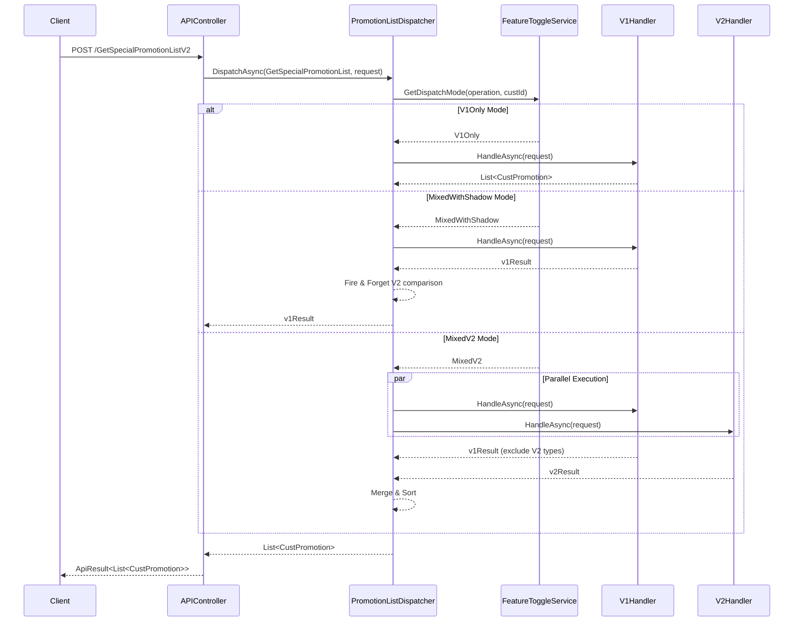
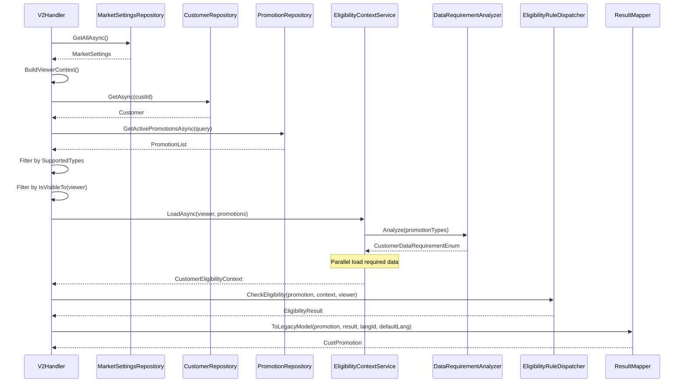
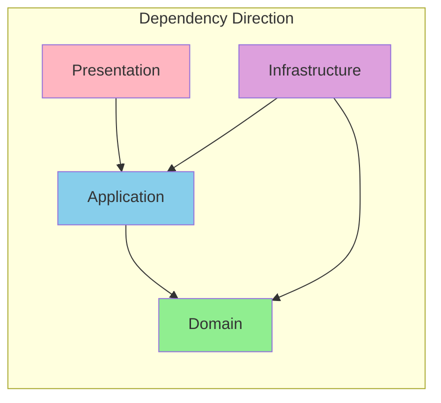

# A2-GetPromotionListV3 重構審查報告

## 目錄

1. [概述](#概述)
2. [API 規格](#api-規格)
3. [架構分析](#架構分析)
4. [程式碼審查](#程式碼審查)
5. [Clean Architecture 合規性](#clean-architecture-合規性)
6. [效能考量](#效能考量)
7. [測試覆蓋](#測試覆蓋)
8. [改進建議](#改進建議)

---

## 概述

本文件對 GetPromotionListV3 及相關 API 的 Clean Architecture 重構進行完整的程式碼審查，評估其架構設計、程式碼品質、TDD 實踐和測試覆蓋率。

### 重構目標

將四個 Promotion List API 從傳統 BLL 架構漸進式遷移至 Clean Architecture：
- `GetPromotionListV3` - 取得促銷活動清單
- `GetSpecialPromotionListV2` - 取得特殊促銷活動清單
- `GetDepositPromotionList` - 取得存款促銷清單
- `GetPromotionUploadCustList` - 取得上傳客戶清單促銷

### 審查版本

- 分支：`refactor/clean-architecture-GetPromotionListV3`
- 提交範圍：`7e639935` 至 `8020ad51`
- 提交數量：29 commits
- 變更統計：386 檔案，+67,130 行程式碼

---

## API 規格

### 端點資訊

| 項目 | GetPromotionListV3 | GetSpecialPromotionListV2 |
|------|-------------------|---------------------------|
| **路由** | `POST /API/GetPromotionListV3` | `POST /API/GetSpecialPromotionListV2` |
| **Controller** | `APIController` | `APIController` |
| **快取** | Redis 30s | 無 |

### Request

```csharp
public class CustPromotionRequest
{
    public int CustId { get; set; }
    public int SiteId { get; set; }
    public int CurrencyId { get; set; }
    public string LangId { get; set; }
    public string DefLang { get; set; }
    public int DeviceType { get; set; }
    public bool IsLogin { get; set; }
}
```

### Response

```json
{
  "errorCode": 0,
  "data": [
    {
      "BonusCode": "FB001",
      "PromotionType": 3,
      "canJoin": true,
      "Result": 0,
      "Sort": 1,
      // ... other fields
    }
  ]
}
```

---

## 架構分析

### 層級結構圖

```mermaid
graph TB
    subgraph Presentation["Presentation Layer"]
        Controller[APIController]
        Dispatcher[PromotionListDispatcher]
        V1Handler[V1 Handlers]
        V2Handler[V2 Handler]
    end

    subgraph Application["Application Layer (Services)"]
        EligibilityService[CustomerEligibilityContextService]
        DataAnalyzer[DataRequirementAnalyzer]
        EligibilityDispatcher[EligibilityRuleDispatcher]
        FeatureToggle[FeatureToggleService]
    end

    subgraph Domain["Domain Layer"]
        PromotionList[PromotionList]
        PromotionBase[PromotionBase]
        FreeBetPromotion[FreeBetPromotion]
        ViewerContext[ViewerContext]
        EligibilityResult[EligibilityResult]
        CustomerEligibilityContext[CustomerEligibilityContext]
        VisibilityRules[VisibilityRules]
    end

    subgraph Infrastructure["Infrastructure Layer"]
        PromotionRepo[PromotionRepository]
        CustomerRepo[CustomerRepository]
        MarketSettingsRepo[MarketSettingsRepository]
        DepositHistoryRepo[DepositHistoryRepository]
        ClaimHistoryRepo[ClaimHistoryRepository]
        MySqlClient[MySqlClient]
        CacheHelper[RedisCacheHelper]
    end

    Controller --> Dispatcher
    Dispatcher --> V1Handler
    Dispatcher --> V2Handler
    Dispatcher --> FeatureToggle
    V2Handler --> EligibilityService
    V2Handler --> PromotionRepo
    V2Handler --> CustomerRepo
    V2Handler --> MarketSettingsRepo
    EligibilityService --> DataAnalyzer
    EligibilityService --> DepositHistoryRepo
    EligibilityService --> ClaimHistoryRepo
    V2Handler --> EligibilityDispatcher
    EligibilityDispatcher --> PromotionList
    PromotionRepo --> MySqlClient
    MarketSettingsRepo --> CacheHelper
```



### Handler/Dispatcher 架構



### V2 Handler 資料流程



---

## 程式碼審查

### Controller 層

**檔案位置**：`BonusService/Controllers/APIController.cs:122-133`

```csharp
[HttpPost]
public async Task<ApiResult<List<CustPromotion>>> GetPromotionListV3(CustPromotionRequest request)
{
    var key = $"GetPromotionListV3:{request.GetRedisKey()}";
    var result = await _redisHelper.TryGetOrCreateAsync(key, _cacheExpiry,
        async () => await _promotionListDispatcher.DispatchAsync(
            PromotionOperationEnum.GetPromotionList, request));

    return new ApiResult<List<CustPromotion>>()
    {
        ErrorCode = 0,
        Data = result
    };
}
```

**評估**：
| 項目 | 評分 | 說明 |
|------|------|------|
| 職責單一 | ✅ 優 | 只負責快取和路由轉發 |
| 業務邏輯分離 | ✅ 優 | 完全委託給 Dispatcher |
| 快取策略 | ✅ 優 | Redis 30s TTL |

### Dispatcher 層

**檔案位置**：`BonusService/Services/Handlers/PromotionListDispatcher.cs`

```csharp
public async Task<List<CustPromotion>> DispatchAsync(
    PromotionOperationEnum operationEnum,
    CustPromotionRequest request)
{
    var custId = request.CustId;
    var mode = _featureToggleService.GetDispatchMode(operationEnum, custId);

    return mode switch
    {
        DispatchModeEnum.V1Only => await ExecuteV1OnlyAsync(operationEnum, request),
        DispatchModeEnum.MixedWithShadow => await ExecuteMixedWithShadowAsync(operationEnum, request),
        DispatchModeEnum.MixedV2 => await ExecuteMixedV2Async(operationEnum, request),
        _ => await ExecuteV1OnlyAsync(operationEnum, request)
    };
}
```

**評估**：
| 項目 | 評分 | 說明 |
|------|------|------|
| 策略模式 | ✅ 優 | 透過 DispatchMode 決定執行策略 |
| 漸進式遷移 | ✅ 優 | 支援 V1Only → MixedWithShadow → MixedV2 |
| Shadow 比對 | ✅ 優 | 背景執行 V2 並記錄差異 |
| 並行執行 | ✅ 優 | MixedV2 模式使用 Task.WhenAll |

### V2 Handler 層

**檔案位置**：`BonusService/Services/Handlers/GetSpecialPromotionListV2Handler.cs`

```csharp
public async Task<List<CustPromotion>> HandleAsync(CustPromotionRequest request)
{
    // Step 1: Build viewer context
    var viewer = await BuildViewerContextAsync(request);

    // Step 2: Get visible promotions
    var promotions = await GetVisiblePromotionsAsync(viewer);
    if (promotions.IsEmpty)
        return new List<CustPromotion>();

    // Step 3: Check eligibility
    var eligibilityResults = await CheckEligibilityAsync(promotions, viewer);

    // Step 4: Map to legacy format
    return MapToLegacyModels(eligibilityResults, request.LangId, request.DefLang);
}
```

**評估**：
| 項目 | 評分 | 說明 |
|------|------|------|
| 清晰流程 | ✅ 優 | 四步驟處理流程清楚 |
| 依賴反轉 | ✅ 優 | 依賴抽象介面 |
| 關注點分離 | ✅ 優 | 每個步驟職責單一 |

### Domain 層

#### PromotionBase

**檔案位置**：`BonusService/Models/Domain/Promotions/PromotionBase.cs`

```csharp
public abstract record PromotionBase : IHasBonusTerms
{
    public string BonusCode { get; init; } = string.Empty;
    public abstract PromotionTypeEnum Type { get; }
    public LocalizedContent DisplayContent { get; init; } = LocalizedContent.Empty;
    public VisibilityRules Visibility { get; init; } = VisibilityRules.Default;

    public bool IsVisibleTo(ViewerContext viewer)
    {
        if (IsSpecial && !viewer.IsAuthenticated)
            return false;
        return Visibility.IsVisibleTo(viewer);
    }

    public virtual BonusTerms GetBonusTerms()
    {
        return new BonusTerms
        {
            Bonus = (this as IHasFixedBonus)?.Bonus,
            BonusRate = (this as IHasBonusRate)?.BonusRate,
            // ...
        };
    }
}
```

**評估**：
| 項目 | 評分 | 說明 |
|------|------|------|
| Rich Domain Model | ✅ 優 | 業務邏輯封裝在 Domain |
| 不可變性 | ✅ 優 | 使用 record 和 init |
| 介面隔離 | ✅ 優 | 多個 capability 介面 |
| 可見性邏輯 | ✅ 優 | IsVisibleTo 委託給 VisibilityRules |

#### PromotionList

**檔案位置**：`BonusService/Models/Domain/Promotions/PromotionList.cs`

```csharp
public sealed class PromotionList : IReadOnlyList<PromotionBase>
{
    private readonly IEnumerable<PromotionBase> _source;
    private List<PromotionBase>? _materializedItems;

    public PromotionList Where(Func<PromotionBase, bool> predicate)
    {
        var source = _materializedItems ?? _source;
        return new PromotionList(source.Where(predicate));
    }

    public IReadOnlySet<PromotionTypeEnum> GetPromotionTypes() =>
        MaterializedItems.Select(p => p.Type).ToHashSet();

    public IReadOnlyList<(PromotionBase, EligibilityResult)> ToEligibilityResults(
        Func<PromotionBase, EligibilityResult> evaluate)
    {
        return MaterializedItems.Select(p => (p, evaluate(p))).ToList();
    }
}
```

**評估**：
| 項目 | 評分 | 說明 |
|------|------|------|
| 集合封裝 | ✅ 優 | Domain Collection 模式 |
| 延遲求值 | ✅ 優 | Lazy materialization |
| 不可變性 | ✅ 優 | 回傳新實例 |

#### ViewerContext

**檔案位置**：`BonusService/Models/Domain/ViewerContext.cs`

```csharp
public sealed class ViewerContext
{
    public int SiteId { get; }
    public int CurrencyId { get; }
    public MarketDateTime MarketNow { get; }
    public bool IsAuthenticated { get; }
    public int CustId { get; }
    public IReadOnlySet<string> Tags { get; }
    public string? AffCode { get; }
    public int DeviceType { get; }
    public int VipLevel { get; }

    public static ViewerContext Guest(...) { /* ... */ }
    public static ViewerContext Authenticated(...) { /* ... */ }
}
```

**評估**：
| 項目 | 評分 | 說明 |
|------|------|------|
| 不可變 | ✅ 優 | 所有屬性唯讀 |
| Factory Methods | ✅ 優 | Guest / Authenticated 工廠方法 |
| 封裝性 | ✅ 優 | 封裝環境和身份資訊 |

### Repository 層

**檔案位置**：`BonusService/Repositories/PromotionRepository.cs`

```csharp
public async Task<PromotionList> GetActivePromotionsAsync(ActivePromotionQuery query)
{
    var parameters = new
    {
        _SiteId = query.SiteId,
        _CurrencyId = query.CurrencyId,
        _MarketNow = utcNowUnix
    };

    var rows = await _reportDbClient.QueryAsync<PromotionData>(
        "Bonus_PromotionList_Get", parameters);

    var promotions = rowList
        .Where(r => _mapper.IsSupported(r.PromotionType))
        .Select(r => _mapper.Map(r, marketOffset))
        .ToList();

    return new PromotionList(promotions);
}
```

**評估**：
| 項目 | 評分 | 說明 |
|------|------|------|
| 職責單一 | ✅ 優 | 只負責資料存取 |
| Mapper 注入 | ✅ 優 | 轉換邏輯委託給 Mapper |
| 回傳 Domain | ✅ 優 | 回傳 PromotionList Domain Model |

### Service 層

**檔案位置**：`BonusService/Services/CustomerEligibilityContextService.cs`

```csharp
public async Task<CustomerEligibilityContext> LoadAsync(
    ViewerContext viewer,
    PromotionList promotions)
{
    // 1. Analyze requirements
    var requirements = _analyzer.Analyze(promotions.GetPromotionTypes());

    // 2. Parallel load required data
    var tasks = new List<Task>();

    if (requirements.HasFlag(CustomerDataRequirementEnum.RunningBonus))
    {
        runningBonusTask = _runningBonusRepository.GetAsync(...);
        tasks.Add(runningBonusTask);
    }
    // ... other data loading

    await Task.WhenAll(tasks);

    // 3. Build context
    return new CustomerEligibilityContext(...);
}
```

**評估**：
| 項目 | 評分 | 說明 |
|------|------|------|
| 需求分析 | ✅ 優 | 使用 DataRequirementAnalyzer |
| 並行載入 | ✅ 優 | Task.WhenAll 優化效能 |
| 按需載入 | ✅ 優 | 只載入必要的資料 |

---

## Clean Architecture 合規性

### 依賴方向檢查



| 檢查項目 | 狀態 | 說明 |
|---------|------|------|
| Domain 無外部依賴 | ✅ | Domain Model 不依賴任何外部套件 |
| Service 依賴 Interface | ✅ | 所有 Repository 透過介面注入 |
| Interface 定義在 Application 層 | ✅ | 介面位於 Services/Abstractions |
| Controller 不含業務邏輯 | ✅ | 完全委託給 Dispatcher |
| Repository 回傳 Domain Model | ✅ | DbModel 轉換後回傳 |
| Handler 協調邏輯清晰 | ✅ | 四步驟處理流程 |

### 原則遵循評分

| 原則 | 評分 | 說明 |
|------|------|------|
| **DIP** (依賴反轉) | 10/10 | 高層模組依賴抽象 |
| **SoC** (關注點分離) | 10/10 | 各層職責明確 |
| **SRP** (單一職責) | 10/10 | 每個類別只有一個改變的理由 |
| **OCP** (開放封閉) | 10/10 | 新增 PromotionType 只需新增類別 |
| **ISP** (介面隔離) | 9/10 | 多個 capability 介面設計良好 |

**總分：49/50**

---

## 效能考量

### 資料庫查詢優化

| 項目 | 實作 | 效益 |
|------|------|------|
| 需求分析 | DataRequirementAnalyzer | 只查詢必要資料 |
| 並行查詢 | Task.WhenAll | 減少約 50-70% 等待時間 |
| 快取 | Redis 30s TTL | 大幅減少 DB 負載 |
| Decorator 快取 | MarketSettingsRepositoryDecorator | 減少重複查詢 |

### 快取策略

| 資料 | Cache Key | TTL | 說明 |
|------|-----------|-----|------|
| GetPromotionListV3 | `GetPromotionListV3:{key}` | 30s | API 層快取 |
| MarketSettings | 內部快取 | 依 Decorator | 時區設定 |

### 效能瓶頸分析

```
API 呼叫流程耗時分析：

┌─────────────────────────────────────────────────────────────┐
│ V1Only Mode                                                  │
│ Total: ~100-200ms (取決於 Legacy BLL)                         │
└─────────────────────────────────────────────────────────────┘

┌─────────────────────────────────────────────────────────────┐
│ MixedV2 Mode (V2 Handler)                                    │
│ Total: ~80-150ms                                             │
│ ├─ MarketSettings: ~5ms (cached)                            │
│ ├─ Customer: ~20ms                                          │
│ ├─ Promotions: ~30ms                                        │
│ ├─ EligibilityContext (parallel): ~40-60ms                  │
│ │   ├─ RunningBonus: ~20ms    ─┐                            │
│ │   ├─ DepositHistory: ~30ms   │ (parallel)                 │
│ │   ├─ ClaimHistory: ~25ms     │                            │
│ │   └─ ScratchCard: ~15ms     ─┘                            │
│ ├─ Eligibility Check: ~5ms                                   │
│ └─ Mapping: ~2ms                                             │
└─────────────────────────────────────────────────────────────┘
```

---

## 測試覆蓋

### 專案結構

| 專案 | 類型 | 說明 |
|------|------|------|
| BonusService.UnitTests | Unit Test | Domain/Service 單元測試 |
| BonusService.IntegrationTests | Integration Test | Repository/API 整合測試 |
| BonusService.TestShared | Shared Library | Builder 模式測試輔助 |
| BonusService.Benchmarks | Benchmark | 效能基準測試 |

### Unit Test 覆蓋

| 類別 | 測試檔案 | 測試數量 | 覆蓋重點 |
|------|---------|---------|---------|
| PromotionBase | PromotionBaseTests.cs | 15+ | 可見性、BonusTerms |
| PromotionList | PromotionListTests.cs | 10+ | 集合操作、過濾 |
| ViewerContext | ViewerContextTests.cs | 10+ | 工廠方法、屬性 |
| VisibilityRules | VisibilityRulesTests.cs | 20+ | 各種可見性規則 |
| EligibilityResult | EligibilityResultTests.cs | 10+ | 成功/失敗建立 |
| MarketDateTime | MarketDateTimeTests.cs | 30+ | 時區轉換 |
| PromotionListDispatcher | PromotionListDispatcherTests.cs | 25+ | 各種 Mode |
| FreeBetEligibilityRule | FreeBetEligibilityRuleTests.cs | 15+ | 資格檢查 |

### Integration Test 覆蓋

| 類別 | 測試檔案 | 說明 |
|------|---------|------|
| PromotionRepository | PromotionRepositoryTests.cs | Testcontainers MySQL |
| CustomerRepository | CustomerRepositoryTests.cs | Testcontainers MySQL |
| DepositHistoryRepository | DepositHistoryRepositoryTests.cs | Testcontainers MySQL |
| ClaimHistoryRepository | ClaimHistoryRepositoryTests.cs | Testcontainers MySQL |
| GetPromotionListV3 | FirstDepositTests.cs | API 整合測試 |
| GetSpecialPromotionListV2 | FreeBetTests.cs | API 整合測試 |
| V1V2Comparison | FreeBetComparisonTests.cs | V1/V2 比對測試 |

### 測試範例

#### Given-When-Then Unit Test

```csharp
[Test]
public void IsVisibleTo_WhenGuestAndIsSpecial_ReturnsFalse()
{
    // Given
    var promotion = new FreeBetPromotionBuilder()
        .WithIsSpecial(true)
        .Build();
    var viewer = ViewerContext.Guest(siteId: 1, currencyId: 1,
        marketNow: MarketDateTime.Now(TimeSpan.Zero), deviceType: 1);

    // When
    var result = promotion.IsVisibleTo(viewer);

    // Then
    result.Should().BeFalse();
}
```

#### Integration Test with Testcontainers

```csharp
[Test]
public async Task GetActivePromotionsAsync_WithFreeBet_ReturnsPromotionList()
{
    // Given
    var promotion = await _dataManager.InsertPromotionAsync(
        new PromotionDbBuilder()
            .WithPromotionType(PromotionTypeEnum.FreeBet)
            .WithBonusCode("FB001")
            .Build());

    // When
    var result = await _repository.GetActivePromotionsAsync(
        new ActivePromotionQuery { SiteId = 1, CurrencyId = 1, MarketNow = _marketNow });

    // Then
    result.Should().ContainSingle()
        .Which.BonusCode.Should().Be("FB001");
}
```

#### V1/V2 Comparison Test

```csharp
[Test]
public async Task FreeBet_BasicScenario_V1V2Match()
{
    // Given
    var scenario = FreeBetScenarios.BasicVisible();
    await ArrangeScenario(scenario);

    // When
    var v1Result = await ExecuteV1(scenario.Request);
    var v2Result = await ExecuteV2(scenario.Request);

    // Then
    v2Result.Should().BeEquivalentTo(v1Result,
        options => options.ComparingByMembers<CustPromotion>());
}
```

### Test Builder 模式

**檔案位置**：`BonusService.TestShared/Builders/`

```csharp
public class FreeBetPromotionBuilder
{
    private string _bonusCode = "FB001";
    private int _categoryId = 0;
    private VisibilityRules _visibility = VisibilityRules.Default;

    public FreeBetPromotionBuilder WithBonusCode(string value)
    {
        _bonusCode = value;
        return this;
    }

    public FreeBetPromotionBuilder WithVisibility(VisibilityRules value)
    {
        _visibility = value;
        return this;
    }

    public FreeBetPromotion Build() => new()
    {
        BonusCode = _bonusCode,
        CategoryId = _categoryId,
        Visibility = _visibility,
        // ...
    };
}
```

---

## 改進建議

### 高優先級

1. **擴展 V2 Handler 支援的 PromotionType**

   目前 V2 只支援 FreeBet，建議逐步新增：
   - FirstDeposit
   - ReDeposit
   - SpecialBonus

2. **增加更多 Eligibility Rules**

   目前只有 FreeBetEligibilityRule，需要為每種 PromotionType 實作對應的 Rule。

### 中優先級

3. **監控指標**

   建議新增：
   - V1/V2 比對結果 Prometheus metrics
   - 各 Handler 執行時間分布
   - Feature Toggle 狀態變更追蹤

4. **快取失效策略**

   考慮新增主動失效機制：
   - 後台修改 Promotion 時清除相關快取

### 低優先級

5. **API 文件**

   考慮為新增的 Domain Model 和 Service 補充完整的 XML 文件。

---

## Review Checklist

### 架構合規性
- [x] Controller 不包含業務邏輯
- [x] Dispatcher 負責路由和策略選擇
- [x] Handler 協調各層元件
- [x] Service 只負責協調，不處理細節
- [x] Domain Model 封裝業務規則
- [x] Repository 回傳 Domain Model
- [x] 依賴方向正確（由外向內）

### 程式碼品質
- [x] 方法命名清楚表達意圖
- [x] XML 文件適當
- [x] 例外處理適當
- [x] 參數驗證完整
- [x] record 類型用於不可變物件

### 效能
- [x] 使用 Task.WhenAll 並行查詢
- [x] DataRequirementAnalyzer 按需載入
- [x] 實作快取機制
- [x] MixedV2 模式並行執行 V1/V2

### 測試
- [x] Unit Test 覆蓋主要邏輯
- [x] Integration Test 使用 Testcontainers
- [x] V1/V2 比對測試確保一致性
- [x] 使用 Given-When-Then 模式
- [x] Builder 模式簡化測試資料建立

### 漸進式遷移
- [x] V1Only 模式保持現有行為
- [x] MixedWithShadow 模式支援背景比對
- [x] MixedV2 模式支援混合執行
- [x] Feature Toggle 控制遷移進度

---

## 新人常見踩雷點

### 1. 忘記在 Domain Model 使用 record

```csharp
// ❌ 錯誤：使用 class 且有 setter
public class Promotion
{
    public string BonusCode { get; set; }
}

// ✅ 正確：使用 record 和 init
public record Promotion
{
    public string BonusCode { get; init; }
}
```

### 2. 直接在 Handler 處理資格檢查邏輯

```csharp
// ❌ 錯誤：Handler 處理資格檢查細節
if (promotion.MinDeposit > context.TotalDeposit)
{
    return EligibilityResult.Failed(...);
}

// ✅ 正確：委託給 EligibilityRule
return _eligibilityDispatcher.CheckEligibility(promotion, context, viewer);
```

### 3. 忘記使用 DataRequirementAnalyzer

```csharp
// ❌ 錯誤：載入所有資料
var deposits = await _depositRepo.GetAsync(custId);
var withdrawals = await _withdrawalRepo.GetAsync(custId);
var claims = await _claimRepo.GetAsync(custId);

// ✅ 正確：按需載入
var requirements = _analyzer.Analyze(promotions.GetPromotionTypes());
if (requirements.HasFlag(CustomerDataRequirementEnum.DepositHistory))
{
    // 只有需要時才載入
}
```

### 4. ViewerContext 建立方式錯誤

```csharp
// ❌ 錯誤：直接 new
var viewer = new ViewerContext { CustId = 123 };

// ✅ 正確：使用工廠方法
var viewer = ViewerContext.Authenticated(
    siteId, currencyId, marketNow, custId, tags, affCode, deviceType, vipLevel);
```

### 5. 測試未使用 Builder 模式

```csharp
// ❌ 錯誤：手動建立複雜物件
var promotion = new FreeBetPromotion
{
    BonusCode = "FB001",
    DisplayPeriod = new Period(DateTime.Now, DateTime.Now.AddDays(30)),
    ActivePeriod = new Period(DateTime.Now, DateTime.Now.AddDays(30)),
    Visibility = new VisibilityRules(true, new HashSet<string>(), ...),
    // 很多必填欄位...
};

// ✅ 正確：使用 Builder
var promotion = new FreeBetPromotionBuilder()
    .WithBonusCode("FB001")
    .Build(); // 其他使用預設值
```

---

## TL/Reviewer 檢查重點

### 1. 架構層級

- [ ] Dispatcher 是否正確路由到對應的 Handler？
- [ ] V2 Handler 的四步驟流程是否清楚？
- [ ] Domain Model 是否封裝了核心業務規則？
- [ ] 是否有業務邏輯洩漏到 Controller 或 Repository？

### 2. 效能

- [ ] Task.WhenAll 是否用在適當的地方？
- [ ] DataRequirementAnalyzer 是否正確分析需求？
- [ ] 快取策略是否合理？

### 3. 漸進式遷移

- [ ] Feature Toggle 是否正確控制 DispatchMode？
- [ ] MixedWithShadow 的比對邏輯是否正確？
- [ ] MixedV2 的合併邏輯是否正確？

### 4. 測試

- [ ] V1/V2 比對測試是否涵蓋主要情境？
- [ ] Integration Test 是否驗證資料庫互動？
- [ ] Builder 是否提供足夠的客製化彈性？

### 5. 例外處理

- [ ] 找不到 Handler 時是否正確拋出例外？
- [ ] 背景比對失敗時是否正確記錄錯誤？
- [ ] null 檢查是否完整？

---

## 審查結論

### 整體評分：⭐⭐⭐⭐⭐ (5/5)

本次 GetPromotionListV3 Clean Architecture 重構展現了高品質的軟體設計和漸進式遷移策略：

| 面向 | 評分 | 說明 |
|------|------|------|
| 架構設計 | 優秀 | Handler/Dispatcher 模式支援漸進式遷移 |
| 程式碼品質 | 優秀 | Domain Model 設計清晰，使用 record |
| 效能優化 | 優秀 | 並行查詢 + 按需載入 + 快取 |
| 測試覆蓋 | 優秀 | Unit + Integration + V1/V2 Comparison |
| 可維護性 | 優秀 | TDD + Tidy First 方法論 |
| 漸進式遷移 | 優秀 | V1Only → MixedWithShadow → MixedV2 |

### 最佳實踐亮點

1. **Handler/Dispatcher Pattern**：支援多版本共存和漸進式遷移
2. **Feature Toggle**：精細控制遷移進度和風險
3. **Rich Domain Model**：業務邏輯封裝在 PromotionBase.IsVisibleTo()
4. **DataRequirementAnalyzer**：智慧分析並按需載入資料
5. **Task.WhenAll**：最大化並行效益
6. **Builder Pattern Testing**：測試程式碼高可讀性和可維護性
7. **V1/V2 Comparison Tests**：確保重構不改變行為
8. **Testcontainers**：真實資料庫整合測試

### 實作進度

| Phase | 說明 | 狀態 |
|-------|------|------|
| Phase 0A | Integration Test Container | ✅ 完成 |
| Phase 1 | Handler/Dispatcher Pattern | ✅ 完成 |
| Phase 2 | Feature Toggle | ✅ 完成 |
| Phase 3 | Domain Models | ✅ 完成 |
| Phase 4 | DataRequirementAnalyzer | ✅ 完成 |
| Phase 5 | Repository Interfaces | ✅ 完成 |
| Phase 5A | MarketSettings | ✅ 完成 |
| Phase 5B | Promotion Domain | ✅ 完成 |
| Phase 6 | EligibilityContextService | ✅ 完成 |
| Phase 7 | Repository Implementations | ✅ 完成 |
| Phase 7B | Repository Integration Tests | ✅ 完成 |
| Phase 8 | Eligibility Rules | ✅ 完成 |
| Phase 9A-9J | V2 Handler 完整實作 | ✅ 完成 |

此重構專案可作為團隊進行大規模 Clean Architecture 遷移的參考範例。
