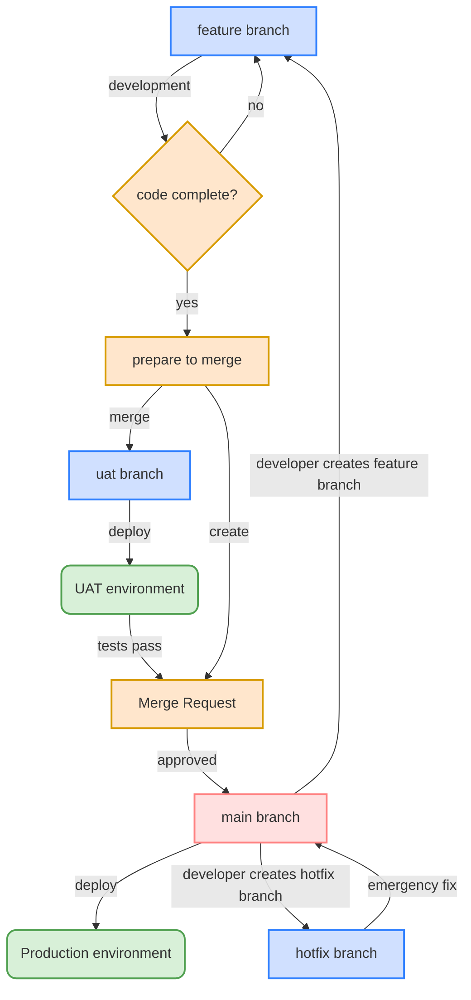

# GitLab Feature Branch Workflow Manual

## Table of Contents

1. [Introduction](#introduction)
2. [Branch Naming Conventions](#branch-naming-conventions)
3. [Workflow Steps](#workflow-steps)
4. [Regular Cleanup of Merged Branches](#regular-cleanup-of-merged-branches)
5. [Regular Rebuilding of Environment Branches](#regular-rebuilding-of-environment-branches)
6. [CICD Deployment Strategy](#cicd-deployment-strategy)
7. [GitLab Feature Branch Workflow Diagram](#gitlab-feature-branch-workflow-diagram)

## Introduction

This manual aims to provide a standardized GitLab Feature Branch workflow to help team members collaborate effectively, ensure code quality, and simplify the release process.

### Core Principles

- The main branch always remains in a deployable state
- All feature development is done in separate feature branches
- Code reviews are conducted through Merge Requests
- Automated testing and deployment processes
- Clear version control and release management

## Branch Naming Conventions

Good branch naming helps team members quickly understand the purpose and status of branches.

### Branch Types

| Branch Type | Current Name | Future Name | Description |
|-------------|--------------|-------------|-------------|
| Main Branch | `PRD` | `main` or `master` | Main development branch, always kept in Production deployment state |
| Feature Branch | `feature/` | `feature/` | Used for developing new features or enhancing existing ones |
| Hotfix Branch | `hotfix/` | `hotfix/` | Used for fixing urgent issues in the production environment |
| Release Branch | `RLS` (optional) | `release` | Used for release preparation (not all projects have this) |
| UAT Branch | `DEV` | `uat` | Used for User Acceptance Testing environment |

> **Note**: Branch naming is transitioning from legacy names to standardized names. During the transition period, both naming conventions may coexist.

### Naming Rules

1. Use lowercase letters
2. Use underscores (`_`) to separate words
3. Be concise but descriptive enough
4. Optional: Include related Jira Task ticket number (e.g., `feature/AAZ-123_user_auth`)

## Workflow Steps

### 1. Creating a Feature Branch

Create a new feature branch from the latest main branch:

```bash
# Ensure the main branch is up-to-date
# Current: PRD, Future: main
git checkout PRD
git pull

# Create and switch to a new feature branch
git checkout -b feature/my_new_feature
```

### 2. Feature and Hotfix Branch Considerations

```bash
# Regularly merge changes from the main branch into the feature branch to keep it updated
git checkout PRD
git pull
git checkout feature/my-new-feature
git merge PRD


# Alternatively, use rebase to keep the branch updated (when the feature branch hasn't merged with other branches)
git checkout PRD
git pull
git checkout feature/my-new-feature
git rebase PRD
```

### 3. Merging Feature Branch to Environment Branch

```bash
# Switch to the UAT environment branch
# Current: DEV, Future: uat
git checkout DEV

# Merge the feature branch into the environment branch
git merge feature/my-new-feature

# Resolve merge conflicts
# Ensure all tests pass
# Commit the merge changes
git commit -m "Merge feature/my-new-feature into DEV"

# Push to the remote repository
git push origin DEV
```

### 4. Merging Hotfix Branch to Main Branch

```bash
# Switch to the main branch
git checkout PRD

# Merge the hotfix branch into the main branch
git merge hotfix/security_vulnerability

# Resolve merge conflicts
# Ensure all tests pass
# Commit the merge changes
git commit -m "Merge hotfix/security_vulnerability into PRD"

# Push to the remote repository
git push origin PRD

# Merge the main branch into other branches to keep them updated
git checkout DEV
git merge PRD
git push origin DEV

git checkout feature/my-new-feature
git merge PRD
git push origin feature/my-new-feature
```

### 5. Deployment Sequence in Development Process

```
local -> uat -> prod
```

### 6. Merge Request

Non-GitLab Repository Managers need a Merge Request to merge into environment and main branches

### 7. GitLab Repository Manager

Appointed by Department Manager and Team Leader

### 8. Force Push Management

- Force Push is **not allowed** on the main branch
- Force Push on other branches can be performed by GitLab Repository Managers
- Team members must be notified in the group after a Force Push is completed

## Regular Cleanup of Merged Branches

To maintain repository cleanliness and efficiency, merged feature branches need to be cleaned up regularly.

### Cleanup Strategy

1. **Cleanup Frequency**
   - Cleanup of merged branches is performed quarterly
   - Notification is sent to the team group before cleanup

2. **Cleanup Scope**
   - Branches that have been merged to the main branch and are more than 8 weeks old

3. **Cleanup Method**
   - Use GitLab's branch cleanup functionality

4. **Retention Rules**
   - Branches marked as "long-term" will not be automatically cleaned up
   - Add a `keep-` prefix to branch names to prevent them from being cleaned up

5. **Cleanup Responsibility**
   - GitLab Repository Manager is responsible for executing the cleanup operation
   - A list of cleaned-up branches should be shared with the team group after cleanup

## Regular Rebuilding of Environment Branches

To ensure the health and stability of environment branches, they need to be rebuilt regularly.

### Rebuilding Strategy

1. **Rebuilding Frequency**
   - UAT environment: Quarterly
   - Production environment: As needed, not on a regular schedule

2. **Preparation Before Rebuilding**
   - Notify all team members one week before rebuilding
   - Create backup branches for environment branches

3. **Rebuilding Method**

```bash
# Rename the environment branch (example: UAT)
# Current: DEV, Future: uat
git branch -m DEV DEV-20250327

# Create a new environment branch from the main branch
git checkout PRD
git pull
git checkout -b DEV

# Merge feature branches into the new environment branch
git merge feature/my-new-feature

# Push the new environment branch to the remote repository
git push --force origin DEV

# Deploy to the environment
```

4. **Verification After Rebuilding**
   - Perform comprehensive environment testing after rebuilding
   - Confirm all features are working properly
   - Notify the team group after successful verification

5. **Emergency Rollback Mechanism**
   - If issues are discovered after rebuilding, quickly roll back to the backup branch

6. **Rebuilding Responsibility**
   - GitLab Repository Manager is responsible for executing the rebuilding operation
   - Coordination with relevant teams is required before and after rebuilding

## CICD Deployment Strategy

### Deployment Process Overview

We use GitLab CI/CD for automated deployment, with different deployment strategies for different branches and environments.

### Environment Deployment Strategy

| Environment | Current Branch | Future Branch | Deployment Method |
|-------------|----------------|---------------|-------------------|
| UAT | `DEV` | `uat` | Automatic/Manual |
| Production | `PRD` | `main` | Manual |

## GitLab Feature Branch Workflow Diagram


