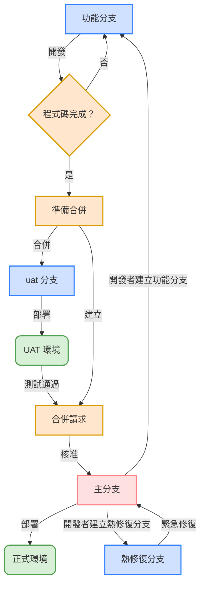

# GitLab 功能分支工作流程手冊

## 目錄

1. [簡介](#簡介)
2. [分支命名規範](#分支命名規範)
3. [工作流程步驟](#工作流程步驟)
4. [定期清理已合併分支](#定期清理已合併分支)
5. [定期重建環境分支](#定期重建環境分支)
6. [CICD 部署策略](#cicd-部署策略)
7. [GitLab 功能分支工作流程圖](#gitlab-功能分支工作流程圖)

## 簡介

本手冊旨在提供標準化的 GitLab 功能分支工作流程，協助團隊成員有效合作、確保程式碼品質，並簡化發布流程。

### 核心原則

- 主分支始終保持可部署狀態
- 所有功能開發都在獨立的功能分支中進行
- 透過合併請求（Merge Request）進行程式碼審查
- 自動化測試和部署流程
- 清晰的版本控制和發布管理

## 分支命名規範

良好的分支命名有助於團隊成員快速了解分支的用途和狀態。

### 分支類型

| 分支類型 | 目前名稱 | 未來名稱 | 說明 |
|----------|----------|----------|------|
| 主分支 | `PRD` | `main` 或 `master` | 主要開發分支，始終保持 Production 部署狀態 |
| 功能分支 | `feature/` | `feature/` | 用於開發新功能或增強現有功能 |
| 熱修復分支 | `hotfix/` | `hotfix/` | 用於修復正式環境的緊急問題 |
| 發布分支 | `RLS`（選用） | `release` | 用於發布準備（並非所有專案都有） |
| UAT 分支 | `DEV` | `uat` | 用於使用者驗收測試環境 |

> **注意**：分支命名正在從舊版名稱過渡到標準化名稱。在過渡期間，兩種命名慣例可能同時存在。

### 命名規則

1. 使用小寫字母
2. 使用底線（`_`）分隔單字
3. 簡潔但具有足夠的描述性
4. 可選：包含相關的 Jira Task 票號（例如：`feature/AAZ-123_user_auth`）

## 工作流程步驟

### 1. 建立功能分支

從最新的主分支建立新的功能分支：

```bash
# 確保主分支是最新的
# 目前：PRD，未來：main
git checkout PRD
git pull

# 建立並切換到新的功能分支
git checkout -b feature/my_new_feature
```

### 2. 功能分支和熱修復分支注意事項

```bash
# 定期將主分支的變更合併到功能分支以保持更新
git checkout PRD
git pull
git checkout feature/my-new-feature
git merge PRD


# 或者，使用 rebase 保持分支更新（當功能分支尚未與其他分支合併時）
git checkout PRD
git pull
git checkout feature/my-new-feature
git rebase PRD
```

### 3. 將功能分支合併到環境分支

```bash
# 切換到 UAT 環境分支
# 目前：DEV，未來：uat
git checkout DEV

# 將功能分支合併到環境分支
git merge feature/my-new-feature

# 解決合併衝突
# 確保所有測試通過
# 提交合併變更
git commit -m "Merge feature/my-new-feature into DEV"

# 推送到遠端儲存庫
git push origin DEV
```

### 4. 將熱修復分支合併到主分支

```bash
# 切換到主分支
git checkout PRD

# 將熱修復分支合併到主分支
git merge hotfix/security_vulnerability

# 解決合併衝突
# 確保所有測試通過
# 提交合併變更
git commit -m "Merge hotfix/security_vulnerability into PRD"

# 推送到遠端儲存庫
git push origin PRD

# 將主分支合併到其他分支以保持更新
git checkout DEV
git merge PRD
git push origin DEV

git checkout feature/my-new-feature
git merge PRD
git push origin feature/my-new-feature
```

### 5. 開發流程中的部署順序

```
local -> uat -> prod
```

### 6. 合併請求

非 GitLab 儲存庫管理員需要透過合併請求才能合併到環境分支和主分支

### 7. GitLab 儲存庫管理員

由部門經理和組長指派

### 8. 強制推送管理

- 主分支**不允許**強制推送
- 其他分支的強制推送可由 GitLab 儲存庫管理員執行
- 強制推送完成後必須在群組中通知團隊成員

## 定期清理已合併分支

為了維護儲存庫的整潔和效率，需要定期清理已合併的功能分支。

### 清理策略

1. **清理頻率**
   - 每季度執行一次已合併分支的清理
   - 清理前在團隊群組中發送通知

2. **清理範圍**
   - 已合併到主分支且超過 8 週的分支

3. **清理方法**
   - 使用 GitLab 的分支清理功能

4. **保留規則**
   - 標記為「長期」的分支不會被自動清理
   - 在分支名稱中加入 `keep-` 前綴以防止被清理

5. **清理責任**
   - GitLab 儲存庫管理員負責執行清理操作
   - 清理後應在團隊群組中分享已清理分支的清單

## 定期重建環境分支

為確保環境分支的健康和穩定，需要定期重建。

### 重建策略

1. **重建頻率**
   - UAT 環境：每季度
   - 正式環境：視需要，非定期

2. **重建前準備**
   - 重建前一週通知所有團隊成員
   - 為環境分支建立備份分支

3. **重建方法**

```bash
# 重新命名環境分支（範例：UAT）
# 目前：DEV，未來：uat
git branch -m DEV DEV-20250327

# 從主分支建立新的環境分支
git checkout PRD
git pull
git checkout -b DEV

# 將功能分支合併到新的環境分支
git merge feature/my-new-feature

# 將新的環境分支推送到遠端儲存庫
git push --force origin DEV

# 部署到環境
```

4. **重建後驗證**
   - 重建後執行全面的環境測試
   - 確認所有功能正常運作
   - 驗證成功後在團隊群組中通知

5. **緊急回滾機制**
   - 如果重建後發現問題，快速回滾到備份分支

6. **重建責任**
   - GitLab 儲存庫管理員負責執行重建操作
   - 重建前後需要與相關團隊協調

## CICD 部署策略

### 部署流程概述

我們使用 GitLab CI/CD 進行自動化部署，不同的分支和環境有不同的部署策略。

### 環境部署策略

| 環境 | 目前分支 | 未來分支 | 部署方式 |
|------|----------|----------|----------|
| UAT | `DEV` | `uat` | 自動/手動 |
| 正式環境 | `PRD` | `main` | 手動 |

## GitLab 功能分支工作流程圖


